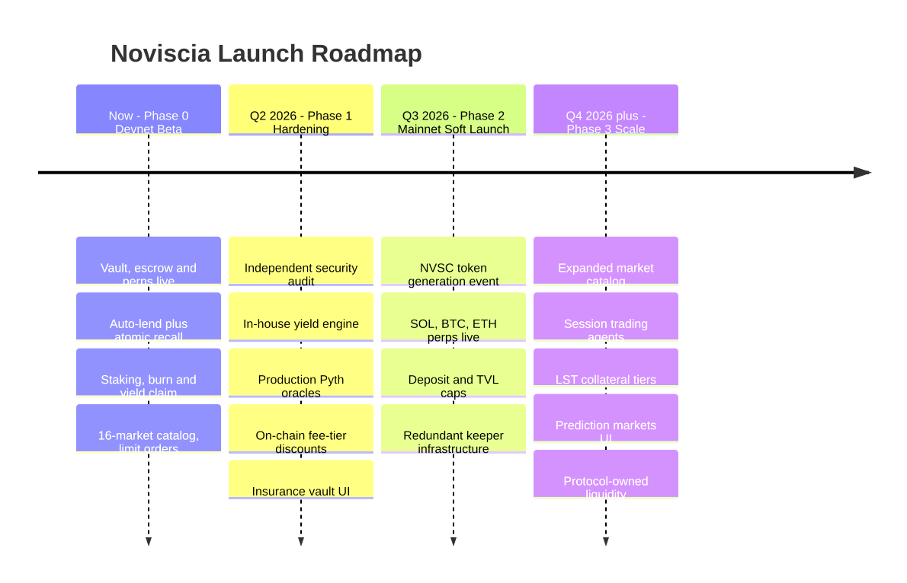
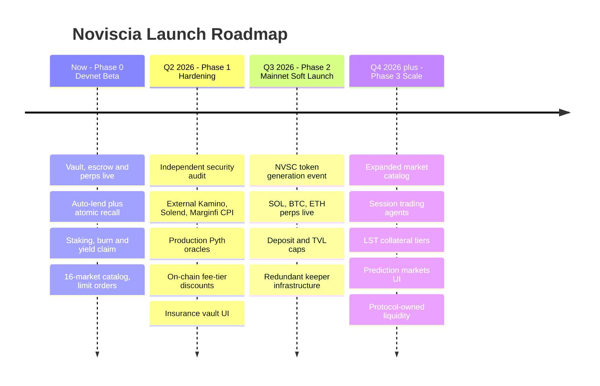

# Noviscia Protocol

**Zero-waste perpetuals on Solana** — margin that earns yield between trades, with atomic recall when you open a position.

| | |
|---|---|
| **Status** | Devnet beta live · Mainnet target Q3 2026 (post-audit) |
| **App** | [noviscia.com](https://noviscia.com) |
| **Whitepaper** | [`docs/WHITEPAPER.md`](docs/WHITEPAPER.md) |
| **Contact** | [Discord](https://discord.gg/Noviscia-protocol) · keziengotho18@gmail.com |

> **Disclaimer:** Devnet software for testing only. Not financial advice, an offer of securities, or a commitment to future features.

---

## Executive summary

Noviscia is a non-custodial perpetual DEX where traders deposit stablecoin margin once, trade USDC-settled perps (up to 50× on majors), and **earn yield on capital that would otherwise sit idle**. Idle margin is deployed across multiple lending venues; when a trader opens a position, funds are **recalled atomically**—no manual withdrawals from external protocols.

A **dual-token design** separates economics from governance:

| Token | Role |
|-------|------|
| **nvscUSDC** | Yield-bearing vault share · perp margin · no votes |
| **NVSC** | Fixed 1B supply · staking tiers · fee share · venue governance |

Revenue flows through a **deflationary flywheel**: perp fees split 40% burn / 60% stakers; lend and vault yield route 85% to users and 15% to the burn engine.

---

## Market opportunity

Perp DEX users routinely hold **$2B+ in idle margin** across venues at any moment. That capital earns **0%** inside typical perp wallets while the same USDC could earn 5–8%+ in lending markets. The friction of manually moving funds between trade and earn products keeps capital inefficient.

Noviscia collapses trade + earn into one non-custodial stack.

---

## Product flow

```text
Deposit USDC
  → Mint nvscUSDC (optional vault shares at NAV)
  → Escrow PDA (user-owned margin account)
  → Keeper deploys idle USDC to venue pools
  → Open perp → atomic recall of lent margin
  → Close position → fees routed on-chain
  → Claim yield · stake NVSC · vote venue weights
```

---

## What's live (devnet)

| Product | Status |
|---------|--------|
| nvscUSDC vault (mint/redeem at NAV) | Live |
| Escrow margin (USDC + nvscUSDC) | Live |
| Perps — SOL, BTC, ETH, BONK, JUP, RAY, WIF, PYTH | Live |
| Auto-lend on idle escrow USDC | Live |
| NVSC staking & governance | Live |
| Rewards, burn engine, yield claim | Live |
| Limit orders (indexer + keeper) | Live |
| Prediction markets | Devnet |
| Jupiter swap | Mainnet |
| PWA (installable web app) | Live |

**Infrastructure:** Keeper and indexer on Railway; Next.js frontend on Vercel; all 10 programs deployed on devnet with on-chain IDLs.

---

## Devnet program IDs

| Program | Address |
|---------|---------|
| position_tracker | `3zGRWKZq4V3npHbH9Lati46BwgmstTjynWZFFMxarQgY` |
| escrow | `CTmCryJca9cFyMRaGdzrhyZeEnjdGLD8ZkEqNcNbvh2D` |
| lending_integrator | `Ea5TXHxsVcnKwMAcAsQkpPN88xr8ndBRpNGDkREWrbSZ` |
| nv_usdc_vault | `CN92hAtnZxbMxPdho8tugi9GDK86UpGwmnbEvk5yzAWC` |
| staking_manager | `4VDQjH73DiE3zYt66ukyWY7KMMJrxHUZfjkxRHTPDG75` |
| burn_engine | `nFgJEQSrKEi7FdAKC6vz5HsQ6f9QjQLBuQcQqQy45id` |
| yield_distributor | `CrN1o75FGwcSo6ted7eKxw2kYgkaXDVeWmUaTZCTsLtw` |
| token_nvsc | `HSaBJHaGa4Hiv1uBYPHQC4ijmnh8237a5LzM8Lyuz1YT` |
| liquidation_vault | `C5mvuPTN7KHQ1NsXSUcD2tEae9fL1pLrNkZD67jRRuf1` |
| prediction_market | `3BTcArdsxKhzF2Msjm3JLy343v6ZvQjPusq3V2zRNbpv` |

Verify: `anchor idl fetch <PROGRAM_ID> --provider.cluster devnet`

---

## Token economics

### NVSC distribution (planned, pre-TGE)

| Allocation | % | Notes |
|------------|---|-------|
| Ecosystem | 35% | 4-year emission |
| Public sale | 25% | TGE schedule TBD |
| Liquidity | 15% | 24-month lock |
| Team | 15% | 12-month cliff, 24-month vest |
| Partners | 10% | 12-month vest |

### Staking tiers

| Tier | Min stake | Documented fee discount |
|------|-----------|-------------------------|
| Bronze | 100 NVSC | −10% |
| Silver | 1,000 NVSC | −25% |
| Gold | 10,000 NVSC | −50% |
| Platinum | 100,000 NVSC | −100% |

On-chain perp fee discount wiring is on the mainnet roadmap; tiers are live for governance and fee-pool share.

### Revenue splits

| Source | User / protocol |
|--------|-----------------|
| Perp trading fees | 60% stakers · 40% burn engine |
| Escrow lend yield | 85% user · 15% burn engine |
| Vault yield | 85% NAV · 15% burn engine |

Full tokenomics: [`docs/WHITEPAPER.md`](docs/WHITEPAPER.md) §4.

---

## Architecture

End-to-end flow — deposit, idle-lend, atomic recall on trade open, settlement, and the fee/burn flywheel:

<p align="center">
  
</p>

**Solid arrows** = funds / instruction flow · **bold arrows** = the atomic recall-and-trade and close-and-settle paths · **dotted arrows** = off-chain cranks and read-only feeds.

<details>
<summary>Mermaid source</summary>


</details>

| Program | Role |
|---------|------|
| `position_tracker` | Perps, dual oracle, liquidation, fee routing |
| `escrow` | Margin custody, idle lend/recall, settlement |
| `nv_usdc_vault` | USDC ↔ nvscUSDC at NAV |
| `lending_integrator` | Multi-venue pools, governed weights |
| `yield_distributor` | User lend-yield claims |
| `staking_manager` | Tiers, proposals, fee pool |
| `burn_engine` | USDC → NVSC buyback & burn |
| `token_nvsc` | Fixed-supply NVSC |
| `liquidation_vault` | Insurance layer (beta) |
| `prediction_market` | Yes/No markets |

---

## Roadmap

<p align="center">
  
</p>

<details>
<summary>Mermaid source</summary>



</details>

| Phase | Deliverables | Target |
|-------|--------------|--------|
| **Phase 0 · Now** | Devnet beta, docs, community testing, keeper/indexer | Live |
| **Phase 1** | Security audit, external Kamino/Solend CPI | Q2 2026 |
| **Phase 2** | Mainnet soft launch, NVSC TGE, production oracles | Q3 2026 |
| **Phase 3** | More markets, mobile, session trading agents | Q4 2026+ |

Detail: [`docs/LAUNCH_ROADMAP.md`](docs/LAUNCH_ROADMAP.md).

---

## Security

- Non-custodial PDA escrow per user
- Dual-oracle consensus (Pyth + keeper marks)
- Maintenance margin and keeper liquidation
- Explicit CPI account constraints across programs
- **Independent audit required before mainnet — not yet completed**

[`docs/SECURITY.md`](docs/SECURITY.md) · [`docs/LEGAL.md`](docs/LEGAL.md)

---

## For developers

### Prerequisites

Node.js 18+, Rust 1.70+, Solana CLI, Anchor 0.31.1 (`avm install 0.31.1`)

### Setup

```bash
npm install
cd app/web && npm install && cd ../..
cp .env.example .env
cp app/web/.env.example app/web/.env.local

anchor build
anchor deploy --provider.cluster devnet
npm run idl:upload-devnet
npm run sync:idls
```

### Run locally

```bash
# Web app → http://localhost:3000
cd app/web && npm run dev

# Keeper
npm run keeper:dev

# Indexer
npm run indexer:dev
```

### Verification scripts

```bash
npm run verify:phase1   # Oracle + config init
npm run verify:phase2   # Market oracles
npm run init:phase1-devnet
npm run init:phase2-devnet
```

### Project layout

```
noviscia-protocal/
├── programs/           # Anchor Rust (10 programs)
├── app/web/            # Next.js 14 frontend + API routes
├── services/
│   ├── keeper/         # Oracle, lend crank, liquidation, burn
│   └── indexer/        # Limit orders, Postgres history
├── scripts/            # Deploy, init, verify, IDL upload
└── docs/               # Whitepaper, roadmap, security, legal
```

---

## Domain

Production: **https://noviscia.com** — setup guide: [`docs/DOMAIN.md`](docs/DOMAIN.md)

## Documentation

| Doc | Path |
|-----|------|
| Whitepaper | [`docs/WHITEPAPER.md`](docs/WHITEPAPER.md) |
| Custom domain | [`docs/DOMAIN.md`](docs/DOMAIN.md) |
| User guide | [`docs/USER_GUIDE.md`](docs/USER_GUIDE.md) |
| Launch roadmap | [`docs/LAUNCH_ROADMAP.md`](docs/LAUNCH_ROADMAP.md) |
| Security | [`docs/SECURITY.md`](docs/SECURITY.md) |
| Legal / risk | [`docs/LEGAL.md`](docs/LEGAL.md) |
| Keeper HA | [`docs/KEEPER_HA.md`](docs/KEEPER_HA.md) |

---

## Links

| | |
|---|---|
| App | https://noviscia.com |
| Discord | https://discord.gg/Noviscia-protocol |
| Twitter | https://twitter.com/noviscia |
| Email | keziengotho18@gmail.com |

---

© Noviscia Protocol
