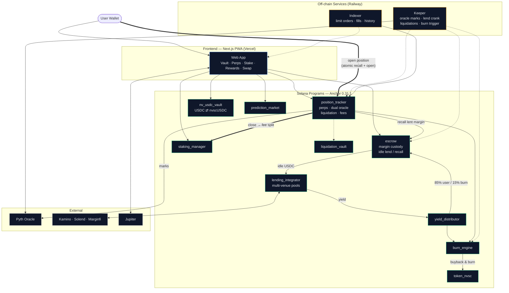
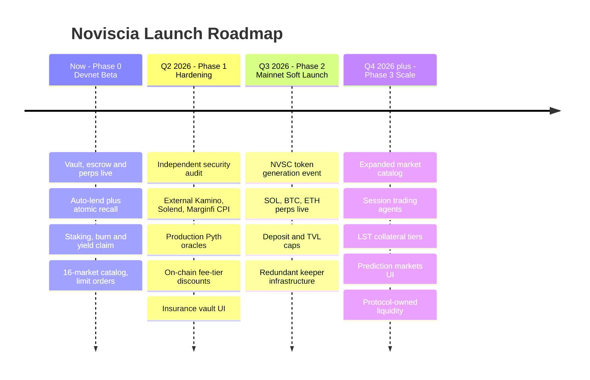

# Noviscia Protocol

**Zero-waste perpetuals on Solana** — margin that earns yield between trades, with atomic recall when you open a position.

| | |
|---|---|
| **Status** | Devnet beta live · Mainnet target Q3 2026 (post-audit) |
| **App** | [noviscia.com](https://noviscia.com) |
| **Whitepaper** | [`noviscia-protocal/docs/WHITEPAPER.md`](noviscia-protocal/docs/WHITEPAPER.md) |
| **Contact** | [Discord](https://discord.gg/Noviscia-protocol) · keziengotho18@gmail.com |

> **Disclaimer:** Devnet software for testing only. This README is not financial advice, an offer of securities, or a commitment to future features. Parameters may change before mainnet.

---

## Executive summary

Noviscia is a non-custodial perpetual DEX on Solana built around one insight: **traders leave billions in margin idle** while perp venues capture none of the lending yield that money could earn. Noviscia routes idle USDC through a multi-venue lending stack, accrues yield to users, and **recalls margin atomically** when a trade opens—no manual withdraw from Kamino or Solend.

The protocol uses a **dual-token model**:

- **nvscUSDC** — yield-bearing vault share used as perp margin (earns, does not vote).
- **NVSC** — fixed 1B governance token for fee tiers, fee share, and venue-weight votes.

Trading fees and protocol yield feed a **deflationary flywheel**: 40% of perp fees fund NVSC buyback & burn; 60% flow to stakers. Lend and vault yield split 85% to users / 15% to the burn engine.

---

## The problem

| Approach | Limitation |
|----------|------------|
| USDC sitting in a perp wallet | Zero yield on idle margin |
| Lending USDC separately | Manual recall before every trade; latency and UX friction |
| Single lending venue | Concentration risk; suboptimal APY as markets shift |

Noviscia treats margin as a **productive asset inside the trading stack**, not a separate earn product.

---

## How it works

```text
USDC → nvscUSDC vault (optional) → Escrow PDA (user-owned)
     → Idle lend (keeper) → Atomic recall → Perps → Settle → Claim / stake / govern
```

**Design principles**

1. **Non-custodial** — Funds live in program-derived escrow accounts; users sign every action.
2. **Atomic recall** — Lent margin is pulled back in the trade flow when required (<400ms target).
3. **Dual-token clarity** — Yield shares do not carry governance votes.
4. **Governed allocation** — NVSC stakers vote on lending venue weights on-chain.
5. **Transparent fees** — Burn, staking, and yield splits are program-configured.

---

## Traction (devnet)

All ten Anchor programs are **deployed on Solana devnet** with on-chain IDLs. Off-chain keeper and indexer run in production on Railway.

| Layer | What's live |
|-------|-------------|
| **Trading** | USDC-settled perps (SOL, BTC, ETH, BONK, JUP, RAY, WIF, PYTH); limit orders; dual-oracle marks |
| **Earn** | nvscUSDC vault (NAV shares); escrow margin; auto-lend on idle USDC |
| **Governance** | NVSC staking tiers; venue-weight proposals |
| **Rewards** | Yield claim; burn engine; fee pools |
| **Adjacent** | Prediction markets; Jupiter swap (mainnet); PWA install |

| Service | Endpoint |
|---------|----------|
| Web app | [noviscia.com](https://noviscia.com) |
| Indexer | `indexer-production-cac8.up.railway.app` |
| Keeper | `keeper-production-c457.up.railway.app` |

---

## Competitive positioning

| | Noviscia | Typical Solana perps |
|--|----------|----------------------|
| Idle margin yield | Automatic, multi-venue | Usually none |
| Yield-bearing collateral | nvscUSDC vault shares | Plain stables |
| Venue governance | On-chain staker votes | Rare |
| Fee → burn flywheel | Built into core programs | Varies |

---

## Token economics (summary)

### NVSC — governance & utility

| Property | Value |
|----------|-------|
| Supply | 1,000,000,000 fixed |
| Utility | Governance, fee tiers, staking fee share |
| Staking tiers | Bronze 100 · Silver 1K · Gold 10K · Platinum 100K NVSC |

**Planned distribution** (subject to change pre-TGE):

| Allocation | % |
|------------|---|
| Ecosystem | 35% |
| Public sale | 25% |
| Liquidity | 15% |
| Team (vested) | 15% |
| Partners | 10% |

### Fee & yield flows

| Source | Split |
|--------|-------|
| Perp trading fees | 40% burn engine · 60% staking pool |
| Escrow lend yield | 85% user · 15% burn engine |
| Vault yield | 85% NAV accrual · 15% burn engine |

**Burn loop:** USDC accumulates in the burn engine → keeper swaps USDC→NVSC → on-chain burn destroys supply.

Full detail: [`docs/WHITEPAPER.md`](noviscia-protocal/docs/WHITEPAPER.md) §4.

---

## Architecture

End-to-end flow — deposit, idle-lend, atomic recall on trade open, settlement, and the fee/burn flywheel:

<p align="center">
  
</p>

**Solid arrows** = funds / instruction flow · **bold arrows** = the atomic recall-and-trade and close-and-settle paths · **dotted arrows** = off-chain cranks and read-only feeds.

<details>
<summary>Mermaid source</summary>



</details>

| Program | Role |
|---------|------|
| `position_tracker` | Perp positions, dual oracle, liquidation, fees |
| `escrow` | User margin; idle lend & recall; settlement |
| `nv_usdc_vault` | USDC ↔ nvscUSDC at NAV |
| `lending_integrator` | Multi-venue pools; governed weights |
| `yield_distributor` | Lend-yield claims |
| `staking_manager` | NVSC tiers; governance; fee pool |
| `burn_engine` | USDC accumulation; NVSC burn |
| `token_nvsc` | Fixed-supply NVSC mint |
| `liquidation_vault` | Insurance / LP layer (beta) |
| `prediction_market` | On-chain prediction markets |

Off-chain: **keeper** (oracle marks, lend crank, liquidations, burns) and **indexer** (limit orders, history) on Railway. Frontend: Next.js 14 PWA.

---

## Roadmap

<p align="center">
  
</p>

<details>
<summary>Mermaid source</summary>



</details>

| Phase | Milestones | Target |
|-------|------------|--------|
| **Now** | Devnet beta, public docs, community testing | Live |
| **Q2 2026** | Security audit, external lending CPI, insurance UI | In progress |
| **Q3 2026** | Mainnet soft launch, NVSC TGE, production oracles | Planned |
| **Q4 2026+** | Expanded markets, mobile app, session agents | Planned |

See [`docs/LAUNCH_ROADMAP.md`](noviscia-protocal/docs/LAUNCH_ROADMAP.md).

---

## Security & risk

- **Non-custodial PDAs** — No pooled custodial wallet; users control escrow accounts.
- **Dual-oracle consensus** — Pyth marks with on-chain deviation checks; keeper liquidation crank.
- **Pre-mainnet audit** — Independent security audit required; **not yet completed**.
- **Devnet only** — Current deployment is for testing; do not use mainnet funds.

See [`docs/SECURITY.md`](noviscia-protocal/docs/SECURITY.md) and [`docs/LEGAL.md`](noviscia-protocal/docs/LEGAL.md).

---

## Repository

All source lives under [`noviscia-protocal/`](noviscia-protocal/). See [`noviscia-protocal/README.md`](noviscia-protocal/README.md) for developer setup, program IDs, and verification scripts.

### Quick developer start

```bash
cd noviscia-protocal
npm install
cd app/web && npm install && cd ../..
anchor build
anchor deploy --provider.cluster devnet
npm run idl:upload-devnet
cd app/web && npm run dev
```

---

## Domain

Production site: **https://noviscia.com** — see [`noviscia-protocal/docs/DOMAIN.md`](noviscia-protocal/docs/DOMAIN.md) for Vercel DNS setup.

## Links

| Resource | URL |
|----------|-----|
| Live app | https://noviscia.com |
| Whitepaper | [`noviscia-protocal/docs/WHITEPAPER.md`](noviscia-protocal/docs/WHITEPAPER.md) |
| User guide | [`noviscia-protocal/docs/USER_GUIDE.md`](noviscia-protocal/docs/USER_GUIDE.md) |
| Launch roadmap | [`noviscia-protocal/docs/LAUNCH_ROADMAP.md`](noviscia-protocal/docs/LAUNCH_ROADMAP.md) |
| Discord | https://discord.gg/Noviscia-protocol |
| Twitter | https://twitter.com/noviscia |
| Email | keziengotho18@gmail.com |

---

© Noviscia Protocol
