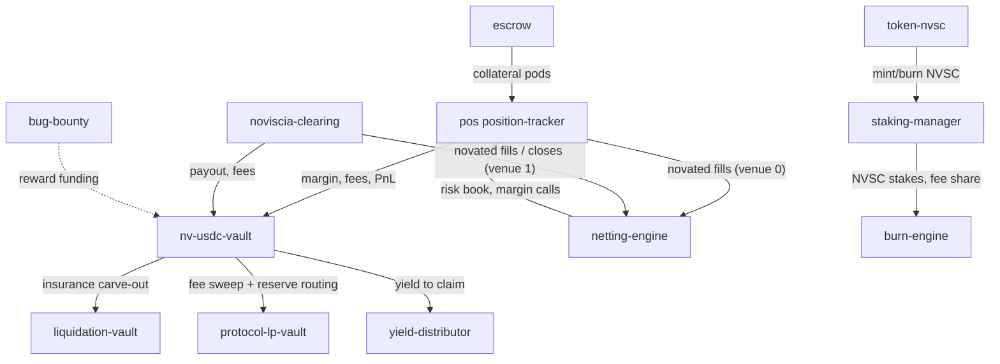

# Noviscia — As It Is Today (devnet, 2026-08-12)

**Status snapshot:** all 12 programs rebuilt from current `main` source, upgraded
in place on devnet (slots 483247186–483249477; netting-engine deploys at
483273207), IDLs synced to
`app/web/app/idl/` and live on-chain.

---

## 1. The One-Line Picture

Noviscia is a **central counterparty (CCP)** on Solana: it interposes on both
sides of every trade (novation), nets offsetting risk, runs all margin as a
single yield-bearing omni-pool, and absorbs default losses through a funded
5-layer waterfall before LPs are ever touched.

```
                        TENANTS / USERS
   ┌────────┬──────────┬──────────┬──────────┬────────────┐
   │ Perps  │ Event    │ DEX/RWA  │ GameFi   │ LP / Stake │   ← frontends
   │ (UI)   │ markets  │ (plug-in)│ (plug-in)│ / Vault    │
   └───┬────┴────┬─────┴────┬─────┴────┬─────┴─────┬──────┘
       │         │          │          │           │
       ▼         ▼          ▼          ▼           ▼
   ┌─────────────── THE CLEARING LAYER (novation + netting) ───────────────┐
   │ position-tracker (perps book, JIT oracle, funding, liquidation)       │
   │ noviscia-clearing (event/outcome markets — parimutuel engine)         │
   └───────────────┬──────────────────────────────────────────────────────┘
                   │  margins / fees / PnL
                   ▼
   ┌─────────────── nv-usdc-vault ── OMNI-POOL + GUARANTEE FUND ──────────┐
   │  nvscUSDC shares · NAV accrual · insurance reserve · default fund     │
   │  Loss waterfall:  trader margin → cross-margin → insurance →          │
   │                   default fund → CCP equity                           │
   └───────────────┬──────────────────────────────────────────────────────┘
                   ▼
   ┌─────────────── YIELD + TOKENOMICS LAYER ──────────────────────────────┐
   │ protocol-lp-vault  yield-distributor  staking-manager  burn-engine    │
   │ token-nvsc (NVSC)  escrow (collateral pods)                           │
   └───────────────┬──────────────────────────────────────────────────────┘
                   ▼
   ┌─────────────── SUPPORT ───────────────────────────────────────────────┐
   │ liquidation-vault (auto-deleveraging) · bug-bounty (security reports) │
   └───────────────────────────────────────────────────────────────────────┘
```

## 2. The 12 Programs On-Chain

| # | Program | Build | Anchor ID | What it does |
|---|---------|-------|-----------|--------------|
| 1 | `position-tracker` | `position_tracker` | `3zGRWKZq4V3npHbH9Lati46BwgmstTjynWZFFMxarQgY` | Perps: markets, JIT oracle price verification, funding, liquidation, cross-margin hooks |
| 2 | `noviscia-clearing` | `noviscia_clearing` | `3BTcArdsxKhzF2Msjm3JLy343v6ZvQjPusq3V2zRNbpv` | Event/outcome markets: create_market, place bet, resolve, claim via parimutuel pool |
| 3 | `nv-usdc-vault` | `nv_usdc_vault` | `CN92hAtnZxbMxPdho8tugi9GDK86UpGwmnbEvk5yzAWC` | Omni-pool: deposit/withdraw nvscUSDC shares, NAV accrue, insurance carve-out, default-fund + CCP-equity reserve routing |
| 4 | `protocol-lp-vault` | `protocol_lp_vault` | `BJVr4bWdNkaUNff3Se6Wob2edPoc64dAaW3Gkgtf4AgT` | Protocol LP layer: fee accumulation, LP NAV, profit share |
| 5 | `yield-distributor` | `yield_distributor` | `CrN1o75FGwcSo6ted7eKxw2kYgkaXDVeWmUaTZCTsLtw` | Yield distribution: claim_yield, compensate_yield, earned-cap |
| 6 | `staking-manager` | `staking_manager` | `4VDQjH73DiE3zYt66ukyWY7KMMJrxHUZfjkxRHTPDG75` | NVSC staking: tiers, rewards, cooldown |
| 7 | `burn-engine` | `burn_engine` | `nFgJEQSrKEi7FdAKC6vz5HsQ6f9QjQLBuQcQqQy45id` | Buyback & burn: accumulates trading fees, trigger_burn, vault_fee_authority |
| 8 | `token-nvsc` | `token_nvsc` | `HSaBJHaGa4Hiv1uBYPHQC4ijmnh8237a5LzM8Lyuz1YT` | NVSC governance token program |
| 9 | `escrow` | `escrow` | `CTmCryJca9cFyMRaGdzrhyZeEnjdGLD8ZkEqNcNbvh2D` | Collateral pods (deposit caps, close_escrow, timelocked admin migration) |
| 10 | `liquidation-vault` | `liquidation_vault` | `C5mvuPTN7KHQ1NsXSUcD2tEae9fL1pLrNkZD67jRRuf1` | Auto-deleveraging, withdraw requests, insurance funding |
| 11 | `bug-bounty` | `bug_bounty` | `A8Uk9WuHumfiuuZAHt4y3t3sXmT3cpXVXaFMhpDinjSK` | On-chain security-report ledger: submit/triage/reward reports |
| 12 | `netting-engine` | `netting_engine` | `68s4vuWUXAaEFF1EM1RUQpw7SFdYZSV3opvtDqoBCs56` | Multilateral Netting & Novation ledger: venue registration, novated-fill reporting, correlation-matrix cross-margin, house book (default-fund sizing) |

All upgrade authority: `pm2tUw22SDofzdfmyJv3jRDhLagwiqYRmCG2BWN23NA`
(`~/.config/solana/new-id.json`).

## 3. The Loss Waterfall (enforced on-chain)

```
 1  Trader initial margin (locked nvscUSDC shares)
 2  Trader cross-margin (other product collateral)
 3  Per-market insurance fund      (10% of liquidation penalties)
 4  Global default fund            (15% of fees → 2.5% of OI target)
 5  CCP equity                     (15% of default fund — skin in the game)
    ─ LP yield / stakers touched only if every prior layer is exhausted ─
```

## 4. Use Cases — Live Right Now

1. **Perps trading** (`/trade/perps`) — up to 50× leverage, fully on-chain
   matching, JIT oracle price verification, funding, TP/SL, permissionless
   liquidation. Margin = nvscUSDC shares that keep yielding while locked.
2. **Event / prediction markets** (`/trade/prediction`) — outcome contracts on
   the parimutuel clearing engine; resolve + claim through the same waterfall.
3. **Omni-pool vault** (`/earn/vault`) — deposit any asset, mint yield-bearing
   nvscUSDC, earn fee + strategy yield, atomic recall for margin calls.
4. **Staking** (`/earn/stake`) — stake NVSC, earn ~15% of protocol fees,
   tiered discounts, vote on parameters.
5. **LPs** (`/earn/lp`) — protocol LP vault share of fee revenue.
6. **Loans / insurance / rewards** (`/earn/loans`, `/earn/insurance`,
   `/earn/rewards`) — collateralized lending surfaces, insurance fund, reward
   claims.
7. **Collateral management** (`/trade/collateral`, `/manage/*`) — deposit,
   withdraw, portfolio, positions, orders, triggers, liquidations.
8. **Token** (`/token`) — NVSC supply, governance, burn status.
9. **Bug bounty** — on-chain security-report ledger (submit/triage/reward).
10. **Tenant settlement web** — DEX/GameFi/RWA frontends route settlement into
    the CCP (vision; contract surface ready, tenants to plug in).

## 5. Program → Interaction Graph



## 6. State Audit Trail

- Rebuilt + upgraded on 2026-08-12 against `main` (HEAD `180b95a4`).
- IDLs regenerated, synced to `app/web/app/idl/`, uploaded to devnet for all 11.
- Deployment scripts: `scripts/deploy/upgrade-*-devnet.sh` (one per program).
- Proof: `solana program show <id>` slots 483247186–483249477, all fresh.

## 7. Gaps (documented, not yet built)

- Claim expiry + residual-sweep waterfall in `noviscia-clearing` (Phase 2 edits).
- Cross-margin correlation matrix (netting engine). **Deployed 2026-08-12** — `netting-engine` live at `68s4vuWUXAaEFF1EM1RUQpw7SFdYZSV3opvtDqoBCs56`, config + house book initialized, venue #0 = perps (position-tracker), venue #1 = event (noviscia-clearing) registered. Venue *reporting* is not yet active: the modified `noviscia-clearing` (fill/close → netting CPI) is still uncommitted and its `ClaimUserFunds` accounts struct exceeds the 4096B stack limit (`Stack offset of 4104 … exceed max offset by 8 bytes`); deploy after shrinking that frame.
- Third-party tenant onboarding flows (contract hooks exist, no tenant live).
- Mainnet deploy (devnet only; `[programs.mainnet]` still placeholders).