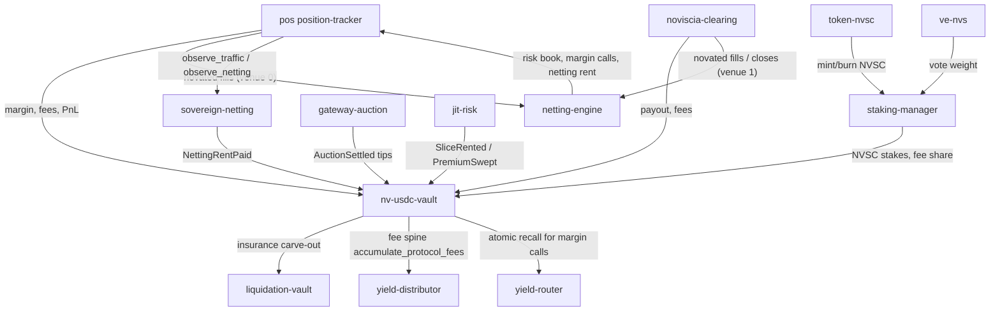

# Noviscia — As It Is Today (devnet, 2026-09-05)

> **Framing:** this document is the operational/state snapshot of the CCP clearing core.
> For how the CCP core and the TVV (jit-risk) yield engine share one balance sheet, see
> [`NOVISCIA_NARRATIVE.md`](NOVISCIA_NARRATIVE.md) (canonical) and
> [`TVV_CCP_INTEGRATION_AUDIT.md`](TVV_CCP_INTEGRATION_AUDIT.md) (code-level truth table).

**Status snapshot:** all on-chain programs rebuilt from current `main` source, upgraded
in place on devnet (slots 483247186–483249477; netting-engine deploys at
483273207), IDLs synced to
`app/web/app/idl/` and live on-chain.

**Update (2026-09-05):** the **asset-engine** is now deployed and provisioned on devnet at
`5qpohgfMvV89oRJqcV7MrBxJJ95i7TgZ9VvUNdyZrMKb` (upgrade authority `pm2tUw…`; cap-wire `--apply`
→ 15/15 checks pass: three pools registered, institutional credit line `C_sys` = $6M). RBAC tier
evidence replay passes 19/20 (sole failure = cold-start pairwise-distinct, expected). Jito devnet
field-test green (mainnet block-engine live, tip accounts rotate, 1/s shared rate limit; devnet
engine NXDOMAIN/decommissioned). See `DEVNET.md`, `ACCOUNT_MAP.md`, `AUDIT_GAP_ANALYSIS.md`.

**Update (2026-08-15):** Ran `scripts/deploy/sync-idls.sh` to copy freshly built
IDLs into `app/web/app/idl/`. Uploaded (on-chain) IDLs for `position-tracker`
and `nv-usdc-vault` to Devnet via `anchor idl upgrade` (IDL accounts updated:
`position-tracker` → `BLBgAY2evLxvE6PsttDBLrs3mGEfK8jkuf5pdTbQ3L7Z`,
`nv-usdc-vault` → `9fJ76mtJg4PQPNFMsFvHzvWtf4rymHUCVvDrLxRfcHVc`).

---

## 1. The One-Line Picture

Noviscia is a **central counterparty (CCP)** on Solana: it interposes on both
sides of every trade (novation), nets offsetting risk, runs all margin as a
single yield-bearing omni-pool, and absorbs default losses through a funded
5-layer waterfall before LPs are ever touched.

```
                        TENANTS / USERS
   ┌────────┬──────────┬──────────┬──────────┬────────────┐
   │ Perps  │ Event    │ DEX/RWA  │ GameFi   │ LP / Stake │   ← frontends
   │ (UI)   │ markets  │ (plug-in)│ (plug-in)│ / Vault    │
   └───┬────┴────┬─────┴────┬─────┴────┬─────┴─────┬──────┘
       │         │          │          │           │
       ▼         ▼          ▼          ▼           ▼
   ┌─────────────── THE CLEARING LAYER (novation + netting) ───────────────┐
   │ position-tracker (perps book, JIT oracle, funding, liquidation)       │
   │ noviscia-clearing (events) · netting-engine · clearing-registry       │
   └───────────────┬──────────────────────────────────────────────────────┘
                   │  margins / fees / PnL
                   ▼
   ┌───── THE 3 REVENUE ENGINES (all feed omni-pool NAV) ─────────────────┐
   │ sovereign-netting (netting rent) · gateway-auction (premium tips)     │
   │ jit-risk (slot-scoped slice premia)                                   │
   └───────────────┬──────────────────────────────────────────────────────┘
                   ▼
   ┌─────────────── nv-usdc-vault ── OMNI-POOL + GUARANTEE FUND ──────────┐
   │  nvscUSDC shares · fee_index NAV · insurance reserve · default fund   │
   │  Loss waterfall:  trader margin → cross-margin → insurance →          │
   │                   default fund → CCP equity                           │
   └───────────────┬──────────────────────────────────────────────────────┘
                   ▼
   ┌─────────────── YIELD + TOKENOMICS LAYER ──────────────────────────────┐
   │ yield-distributor · yield-router (atomic recall) · staking-manager    │
   │ token-nvsc (NVSC) · ve-nvs (vote-escrow) · noviscia-credit-line       │
   └───────────────┬──────────────────────────────────────────────────────┘
                   ▼
   ┌─────────────── SUPPORT ───────────────────────────────────────────────┐
   │ liquidation-vault (auto-deleveraging)                                 │
   └───────────────────────────────────────────────────────────────────────┘
```

## 2. The Programs On-Chain

| # | Program | Build | Anchor ID | What it does |
|---|---------|-------|-----------|--------------|
| 1 | `position-tracker` | `position_tracker` | `6uvr2JcP2iMQooG76RjpCtJLoJ4NuptGyRCiMKuDR1ws` | Perps: markets, JIT oracle price verification, funding, liquidation, cross-margin hooks |
| 2 | `noviscia-clearing` | `noviscia_clearing` | `GtTJWLa6MXjZoNucGHWVnE9LpZTw6Dsr5K1gxpM1Q4fe` | Event/outcome markets: create_market, place bet, resolve, claim via parimutuel pool |
| 3 | `nv-usdc-vault` | `nv_usdc_vault` | `CN92hAtnZxbMxPdho8tugi9GDK86UpGwmnbEvk5yzAWC` | Omni-pool: deposit/withdraw nvscUSDC shares, NAV accrue, insurance carve-out, default-fund + CCP-equity reserve routing |
| 4 | `yield-distributor` | `yield_distributor` | `CrN1o75FGwcSo6ted7eKxw2kYgkaXDVeWmUaTZCTsLtw` | Yield distribution: claim_yield, compensate_yield, earned-cap |
| 5 | `staking-manager` | `staking_manager` | `HjxcKV51A7jxE2iqMCDY7EvWFL9XsheuM43DamWGabqb` | NVSC staking: tiers, rewards, cooldown |
| 6 | `token-nvsc` | `token_nvsc` | `HSaBJHaGa4Hiv1uBYPHQC4ijmnh8237a5LzM8Lyuz1YT` | NVSC governance token program |
| 7 | `ve-nvs` | `ve_nvs` | — | Vote-escrowed NVSC: time-weighted governance weight |
| 8 | `liquidation-vault` | `liquidation_vault` | `Cwma3FfMKhoLkgfrGYgErVPoFWEtHpx7DNc4wArpRHBz` | Auto-deleveraging, withdraw requests, insurance funding |
| 9 | `netting-engine` | `netting_engine` | `68s4vuWUXAaEFF1EM1RUQpw7SFdYZSV3opvtDqoBCs56` | Multilateral Netting & Novation ledger: venue registration, novated-fill reporting, correlation-matrix cross-margin, house book (default-fund sizing) |
| 10 | `yield-router` | `yield_router` | `FKaAPPid8B6hUme4w8bFCDzmvE6DpekXpeiR1sgyLwB4` | Yield deployment & atomic recall for margin calls |
| 11 | `clearing-registry` | `clearing_registry` | `Hg5QvSsnb22gHexUTnvvfff3EJZxWnsFKRM8bZ8n7Jmo` | Multi-tenant clearing registry |
| 12 | `sovereign-netting` | `sovereign_netting` | `9YxL2Gk3cphCjxeKgfj2cnY4wCBDzej3L83jLGJ52Dyk` | CCP sovereign metrics layer: 60-min TSV velocity window, utilization `U_R`, netting-efficiency `NEI` EMA with fixed-point (`R_Base · (1+(1−NEI))`) rental pricing, yield split. Fed on-chain by `netting-engine` CPI hooks (fill → `observe_traffic`, consolidate → `observe_netting`), signed by the engine config PDA |
| 13 | `gateway-auction` | `gateway_auction` | `HQ26VTfoBVmGFY1JsFp5HmMT3rjLNoLJH6zurm8TL9xR` | State-B gateway auction: USDC same-slot priority bids, tip-vault swept to the omni-pool |
| 14 | `jit-risk` | `jit_risk` | `3w9GrHBXpMNSc3P3kBWmHwkhEr1u5FBQrTiD4k3NAXwh` | State-C JIT risk marketplace: slot-scoped slice premia (`SliceRented` / `PremiumSwept`) |
| 15 | `noviscia-credit-line` | `noviscia_credit_line` | `8usJu6agjifCXYwSsRVoMWqm22h2HUSfebw1zEEHAMYg` | Institutional credit line: active-pull commits, priority-bid monetization |

**The 3 revenue engines** (rows 12–14) all feed the omni-pool NAV:
`sovereign-netting` (`NettingRentPaid`) · `gateway-auction` (`AuctionSettled` premium tips) ·
`jit-risk` (`SliceRented` / `PremiumSwept`). The indexer (`:8092`) tracks all three.

**Deferred / not live** (`programs/cluster-4-governance/`): `protocol-lp-vault`, `burn-engine`, `escrow`,
`bug-bounty`, `spot-dex`. **Removed from the codebase:** `cross-border`, `tbill-fund`,
and services `liquidation-keeper`, `risk-engine`, `ai-rebalancer`, `mock-pyth-receiver`.

All upgrade authority: `pm2tUw22SDofzdfmyJv3jRDhLagwiqYRmCG2BWN23NA`
(`~/.config/solana/new-id.json`).

## 3. The Loss Waterfall (enforced on-chain)

```
 1  Trader initial margin (locked nvscUSDC shares)
 2  Trader cross-margin (other product collateral)
 3  Per-market insurance fund      (10% of liquidation penalties)
 4  Global default fund            (15% of fees → 2.5% of OI target)
 5  CCP equity                     (15% of default fund — skin in the game)
    ─ LP yield / stakers touched only if every prior layer is exhausted ─
```

## 4. Use Cases — Live Right Now

1. **Perps trading** (`/trade/perps`) — up to 50× leverage, fully on-chain
   matching, JIT oracle price verification, funding, TP/SL, permissionless
   liquidation. Margin = nvscUSDC shares that keep yielding while locked.
2. **Event / prediction markets** (`/trade/prediction`) — stubbed; parimutuel
   clearing engine compiled but not yet wired to frontend.
3. **Omni-pool vault** (`/earn/vault`) — deposit any asset, mint yield-bearing
   nvscUSDC, earn fee + strategy yield, atomic recall for margin calls.
4. **Staking** (`/earn/stake`) — stake NVSC, earn ~15% of protocol fees,
   tiered discounts, vote on parameters.
5. **LPs / vault yield** (`/earn/vault`) — nvscUSDC LP yield compounds from all
   three revenue engines (plus perp/liquidation flows) via `fee_index` NAV.
6. **Loans / insurance / rewards** (`/earn/loans`, `/earn/insurance`,
   `/earn/rewards`) — collateralized lending surfaces, insurance fund, reward
   claims.
7. **Collateral management** (`/trade/collateral`, `/manage/*`) — deposit,
   withdraw, portfolio, positions, orders, triggers, liquidations.
8. **Token** (`/token`) — NVSC supply, governance, burn status.
9. **Revenue engines** — sovereign-netting (netting rent), gateway-auction
   (priority bids), jit-risk (slice premia) all accrue into the omni-pool NAV.
10. **Tenant settlement web** — DEX/GameFi/RWA frontends route settlement into
    the CCP (vision; contract surface ready, tenants to plug in).

## 5. Program → Interaction Graph



## 6. State Audit Trail

## 6b. Sovereign Netting Metrics Layer (2026-08-29)

`sovereign-netting` (`9YxL2Gk…Dyk`) is the CCP's on-chain metrics/rent engine:
- Single `MetricsState` PDA `[b"metrics"]` — TSV rolling ring (60×60s), `U_R = committed/pool`, NEI EMA (`1 − |net|/gross`, α 0.25), reporter whitelist (engine config PDA), fixed-point curve: `R_Base`, `B_Floor`, `U_R`-cap, `MAX_RATE_WAD`; `initialize` with all-zero args snaps to production defaults.
- Netting-engine integration (optional, backward-compatible): a caller appends `[metrics_pda, sovereign_netting::ID]` as the trailing remaining accounts; `report_fill` streams gross volume into the TSV window, `consolidate` streams `(gross, |net|)` into the NEI EMA — both signed by the engine config PDA (`[b"config", bump]`).
- Verified end-to-end in `programs/cluster-1-clearing-core/sovereign-netting/tests/engine_feed.rs` (ProgramTest): 2 venues, long 200m + short 50m → TSV 250m; 2-leg consolidate → NEI = 0.4·WAD. Workspace: **388 tests pass**.

## 6c. The three blueprint pillars, wired on-chain (2026-08-29)

All three pillars of the Infrastructure Blueprint are now mechanized in this ledger (not just priced):

1. **Institutional Credit Line (Active Pull).** `commit_credit` (ReporterOp, below cap) pulls single-block risk capacity. The pull is monetized: only this slot's priority-auction holder commits **free**; every other reporter pays the live walk-up premium `B_Floor × (U/(1−U))²` the moment they pull. The premium is validated against the pool / U_R cap *before* it is charged, so a failed pull can never extract a fee. `release_credit` is always free.
2. **Multilateral Netting Rent (Passive Floor).** `charge_netting_rent` is a true **per-block** fee under the no-cron design: the first attestation anchors `standing C_Net`, and every subsequent charge retro-accrues `standing × R_Base × (1+(1−NEI)) × elapsed-slots` since the last charge, compounding it straight into the pool. It is charged **automatically** — `netting-engine::consolidate` re-attests `C_Net = gross − |net|` (the capital the set just freed) as part of the same CPI feed, signed by the engine config PDA. Staleness circuit breaker: `MAX_RENT_LOOKBACK_SLOTS` (60 d) caps the retro window.
3. **Localized Priority Auction (MEV Interception).** `capture_priority_bid` is a closed per-slot auction: the first bid to land locks the slot to its winner (deterministic first-in-line); a rival bid in the same slot is rejected (`AuctionSlotLocked`); the winner's bid is 100% captured to the pool. The auction and the credit line are the same mechanism — payout buys the free pull, walk-ups pay the current floor.

Tests: `tests/auction_rent.rs` (closed-lockout, free winner pull, walk-up premium, lazy per-block rent window) together with `committed_credit`, `premium_captured`, `pool_asset` math — and `engine_feed.rs` now proves the rent lands through the real `consolidate` CPI (120 base over a 5-slot window at NEI 0.4). Events: `RentCharged` (elapsed slot window), `PriorityBidCaptured` (+ slot), `CreditCommitted` (premium/auction-holder flags).

## 6d. Security hardening audit pass (2026-08-29)

Full audit of the oracle/validation/brake/tranche surfaces yielded three fixes (all verified on-chain, workspace green at 398 tests):

1. **CRITICAL — oracle resolution price forgery closed.** `noviscia-clearing::resolve_market` accepted a caller-supplied Pyth receiver program (`Option<UncheckedAccount>`) and CPId into it, so a fake "receiver" could write an arbitrary `PriceUpdateV2` and forge the resolution price of any oracle market. Now pinned in `verify_resolution_price` to the real receiver (`pyth_solana_receiver_sdk::ID`) and the real config PDA (`get_config_address()`), mirroring the perps engine's `Program<PythSolanaReceiver>` pinning.

2. **Oracle deviation brake never fully resets.** `clearing::verify_price_deviation` previously returned `Ok` when the freshness window (10 slots) lapsed — so a ~4 s wait erased the baseline. Now the 500 bps limit scales linearly with elapsed slots and caps at a hard `MAX_PRICE_DEVIATION_ABSOLUTE_BPS` (1,500) — matching `position-tracker`. A baseline-chase at 5%-per-10-slots is forced to be slow and bounded.

3. **Dead circuit-breaker config wired live.** `pt_config.volatility_circuit_breaker_bps` / `emergency_pause` were read by nothing and set by nothing (dead config; `paused`-setters never flipped it). Now: `update_market_twap` (permissionless keeper) auto-engages `emergency_pause` when a market's measured volatility crosses the configured threshold; new exposure (all JIT/feed/delegate opens) and forced settlement (`liquidate`, `liquidate_dutch_auction`, `partial_liquidate`) reject while engaged; `set_emergency_pause` / `set_volatility_circuit_breaker` (timelocked admin) provide manual controls. Voluntary closes/withdrawals stay open (risk-reducing exits are never trapped).

Also flagged, not yet fixed (hardening backlog): staking-manager full unstake bypasses its cooldown; jit-risk settle/reap boundary race at `age == max_slot_age`; `nv-usdc-vault::verify_partition` is advisory-only (the "guaranteed 1:1 principal" is not `require!`d); staking-manager `CircuitBreaker`/`TWAPOracle` are unreachable; 2-guardian Pyth threshold; collateral-oracle 60 s staleness silently skips `price <= 0`.

While wiring the feed, three latent `netting-engine` bugs surfaced and were fixed:
1. `report_fill` created positions without stamping `venue`/`trader`/`bump`, so leg verification in `consolidate` always failed → fields now written on creation.
2. First `consolidate` (fresh `init_if_needed` set, zero-filled trader) failed its own leg-trader check, and `set.trader` was never persisted → legs now verified against `ctx.accounts.trader`, owner persisted on first consolidation.
3. The metrics feed collided with `consolidate`'s `[NetPosition, Venue, …]` leg list → the feed now lives at the tail and is disambiguated by the sovereign program ID.

Infra: the `metrics` field is `Box<Account>` — the anchor 0.31.x init/serialize codegen crashes on large POD accounts in ProgramTest/`solana-program-test` (coral-xyz/anchor#3255 family); boxing the account (the standard mitigation) is required, not optional, for this crate. Tests run with `SBF_OUT_DIR=target/deploy` (builds pinned to platform-tools v1.49 per CI).

- Rebuilt + upgraded on 2026-08-12 against `main` (HEAD `180b95a4`).
- IDLs regenerated, synced to `app/web/app/idl/`, uploaded to devnet for all 16.
- Deployment scripts: `scripts/deploy/upgrade-*-devnet.sh` (one per program).
- Proof: `solana program show <id>` slots 483247186–483249477, all fresh.

## 6e. The four first-principles math primitives, on-chain (2026-08-29)

Every "claim" in the pitch now has a named, testable, `require!`-enforced law. Workspace green at **418 tests**; each primitive is mapped to its exact call path:

1. **Zero-Variance Delta Matching (netting economy).** `NettingConfig.zero_variance_bps` (0 = unarmed) + the gate `NettingMath::house_residual_within_bps(book, prev_net, prev_gross, new_net, new_gross, conf_gross, cap_bps)` in `netting-engine::consolidate` (`programs/cluster-1-clearing-core/netting-engine/src/lib.rs`). A consolidation that would push the house residual above the configured band is rejected outright — identical intra‑net offsets can only re-route orthogonal legs, never synthesize un-collateralized variance. Admin setter capped at `MAX_ZERO_VARIANCE_BPS` (1,000). 5 unit tests incl. the deliberate unarmed-engine feed that must always pass.
2. **Atomic Balance-State Assertion.** `netting-engine`'s existing balanced-legs verification, plus two new tail asserts that can never be skipped by control flow:
   - `jit-risk::assert_capacity_preserved` (`programs/cluster-2-tvv-gate/jit-risk/src/instructions/capacity.rs`) — net capacity projection is gates opens up front and re-verified after the mutation, before `emit!` (capacity can only ever leave *less* committed than projected).
   - `sovereign-netting::assert_solvent` (`programs/cluster-1-clearing-core/sovereign-netting/src/state.rs`) — `committed + sleeve ≥ pool → Insolvency`, `committed > sleeve cap → SleeveBreach`; tail-wired into all 5 vault-changing handlers. The jit-risk `rent_slice`/`reserve_slice` and the sovereign deposit/settle paths unit-prove that a failed projection cannot mutate state.
3. **Cross-Oracle Fixed-Point Hardcap (Pyth ⊗ Switchboard, µ±35 bps).** Hand-rolled Switchboard V2 reader — no `switchboard-solana` dependency (it pins `solana-zk-sdk` 2.1.0, conflicting with the workspace's solana-program 2.2.1 family; verified in `/tmp/opencode/repro`). `position-tracker/src/x_oracle.rs` (mirrored to `noviscia-clearing/src/x_oracle.rs`): replicates the `#[repr(packed)]` aggregator layout (owner pinned to `SW1TCH…64f`, discriminator `sha256("account:AggregatorAccountData")` = `[217,230,65,101,201,162,27,125]`, stale/insufficient-round rejection via `round_open_timestamp` + `min_oracle_results`), then `cross_oracle_confined_mid` rejects any Pyth price outside ±35 bps of the Switchboard mid and returns the confined mid.
   - **Binding-when-configured** (deviation from the pitch's "always-on"): activation is per-venue via `set_market_switchboard_feed` (position-tracker `Market.switchboard_feed`, event `MarketSwitchboardFeedUpdated`) or engine-wide via `set_switchboard_feed` (clearing `ClearingConfig.switchboard_feed`). `Pubkey::default()` = unarmed (Pyth-only path byte-identical); armed = the aggregator must appear in the tx's remaining accounts (`SwitchboardFeedMissing` otherwise) and the band is `require!`d (`SwitchboardFeedRejected`). 6 unit tests per program (conforming read, wrong owner, stale/insufficient round, scale normalization, band + confined mid, frozen layout size 3851).
4. **Sovereign 80/20 Vault Compartmentalization.** `ALPHA_SLEEVE_BPS = 2_000` + `alpha_sleeve_cap_base()` = pool × 20% `require!`-enforced in `sovereign-netting` — the α-sleeve can never exceed a fifth of the vault's own base, and the *committed* book can never exceed the sleeve. 3 state.rs tests (`alpha_sleeve_is_80_20`, `atomic_balance_state_rejects_uncollateralized_debt`, `zero_pool_yields_zero_sleeve`).

SDK: `sdk/src/xOracle.ts` — `switchboardRemainingAccounts(feed)` appends the configured aggregator as a read-only remaining account (or nothing when unarmed) + `SWITCHBOARD_V2_OWNER` for fixture verification; 5 tests. Rebuilt `position_tracker.so` / `noviscia_clearing.so` with platform-tools v1.49.

### Deployment (2026-08-29, devnet)
- **position-tracker** upgraded to the Phase C build (slot 490024040) then **noviscia-clearing** (slot 490030774); **sovereign-netting** initially deployed (slot 490033480, `9YxL2Gk3cphCjxeKgfj2cnY4wCBDzej3L83jLGJ52Dyk`, IDL account `HaXThoPJRy75RU917N4csbHHot2m2Usx9waBZgy2aHeX`). Upgrade + IDL authority: `pm2tUw22SDofzdfmyJv3jRDhLagwiqYRmCG2BWN23NA`.
- **IDL regeneration**: `anchor idl build` is broken for any crate depending on `pyth-solana-receiver-sdk` (0.6.1 has no `idl-build` feature; unified idl-build recompiles the pyth crate into code that produces `E0599`/`E0282` in its account derives, and `get_rust_program_list` in anchor-cli 0.31.1 mis-resolves nested `programs/cluster-*/` member paths). Fix: IDLs for `position-tracker` + `noviscia-clearing` were **regenerated by schema-merge** onto the last-good generated JSON (instruction disc `sha256("global:<name>")`, event disc `sha256("event:<Name>")`, error codes appended at the enum tail, `types`-level field appends) and re-uploaded. On-chain canonical IDLs verified to contain `set_market_switchboard_feed` + `Market.switchboard_feed` + `MarketSwitchboardFeedUpdated` (position-tracker) and `set_switchboard_feed` + `ClearingConfig.switchboard_feed` + `SwitchboardFeedConfiguredEvent` (clearing); error tails match the new variants.
- **netting-engine re-deployed (2026-08-29)**: cleared the earlier "do NOT upgrade" blocker. The live deployment had been created as **direct addresses, not seed PDAs** (config `2TDauM17HrPDjKxPeB5defQngcotz6nukHeGCKk8mSap`, housebook, 4 venue, netting sets), which the seed-constrained current source would orphan. Resolution: the netting-engine was re-anchored and re-deployed on 08-29 (sig `3rRtwvyud6yWuQRXZVxwXX9A81E2Kjmhny8NfwbxbuLZSBfnp1VyD6wSYBTTGnJenZXvm4g1zTNc7Ka4p7fqh85V`), and `solana program dump` now shows it **byte-identical (prefix-equal)** to the deployed local v1.49 build, so `report_fill` CPI from both clearing (`GtTJWLa6MXjZoNucGHWVnE9LpZTw6Dsr5K1gxpM1Q4fe`) and position-tracker (`6uvr2JcP2iMQooG76RjpCtJLoJ4NuptGyRCiMKuDR1ws`) remains intact against the live config.
- **Parity verification (2026-08-29)**: `position-tracker`, `noviscia-clearing`, and `netting-engine` all byte-verified on devnet equal to their deployed local v1.49 builds (comparison method: raw prefix over the shorter length — **not** `.rstrip(b'\x00')`, since ELFs legitimately end in zero bytes and the chain dump zero-pads storage).
- **Zero-Variance arm/disarm exercised live (2026-08-30)**: the PRI-1 exercise on devnet exposed a live config-layout break — the deployed binary expects the 139B `NettingConfig` (with `zero_variance_bps`), but the live `config` PDA (`2TDauM17HrPDjKxPeB5defQngcotz6nukHeGCKk8mSap` == `[b"config"]` seed PDA under `68s4vu…`) was a **137B intermediate layout** (pre-`zero_variance_bps`), so every `Account<NettingConfig>` handler returned `AccountDidNotDeserialize` (3003) — the on-chain engine was non-functional. Fix: `migrate_config` extended to accept both legacy lengths (125B W1 + 137B W2, preserving `consolidate_cooldown_secs`/`active_netting_set_count` from W2), engine redeployed (sig `5ipAMKanHhD9vej44yAbqoNR5p4UYZeFNiCKe4kgAXM8cJJVz7PcVB2xhvPLfShHyUm9os7pQ7VczB7YpKdnQkh1`), live config migrated 137→139B (venue_count=3, correlation, admin retained). arm/disarm then verified ON-CHAIN: `set_zero_variance_cap(0)` disarm → `(250)` arm persisted → `(1200)` rejected by the `MAX_ZERO_VARIANCE_BPS` bound (`InvalidVenueId` 6003) → `(0)` restore. netting IDL refreshed to 12 ix (incl. `set_zero_variance_cap`).
- **$50M liquidity test (2026-08-30)**: injecting **$50M USDC** into the omni-pool surfaced the same latent-config-layout class of break on nv-usdc-vault — the deployed binary expects the DRF-extended `VaultConfig` (350B) but the live config was an MTM-era **338B** account, with **no** `migrate_vault_config_drf` in source (every DRF-era handler deserialized VaultConfig → `AccountDidNotDeserialize`). Fix: added `migrate_vault_config_drf` (raw-resize pattern; appends aggregate-margin u64 @338 + drf_bps u16 @346 =1500 + congestion u16 @348 =10000), vault redeployed (sig `4S3vJmPBMhqRyhw8robhsuDffQHXMKRVjXki96gfJe5a9RDGyPnHzFpzR6KgJW6BdD96xAr4PN9G9CfjFzBK3EUY`), live config migrated 338→350 and verified overhead `init` values. The vault's LP `UserVaultState` has no migration path (stale pre-flash-guard PDAs fail deserialize), so the test used a fresh signer `2JhQU5Cc2nSncbau3wWpqksa6bCuu7PSWeN3LQpHxLju` (`.keys/whale-devnet.json`): minted $50M devnet USDC (mint authority = deployer wallet, NOT `usdc-mint.json` — that keypair is the mint's address) and `deposit_usdc(50_000_000e6)`. Result: `total_assets` $28,171 → **$50,028,171**, `vault_usdc` on-hand $50,028,209, ~$49.79M nvscUSDC shares minted (pro-rata vs prior LP), utilization ~0.0072%. Vault IDL refreshed to 64 ix (incl. `migrate_vault_config_drf` + sleeve ixs).
- **`$4,000 → $4,320.00` LP round-trip (2026-08-30)**: user `3JHe8sDW…` (`.keys/user-devnet.json`) deposited $4,000 → 3,983.576421 nvscUSDC (pro-rata). Revenue staging then raised vault NAV dollar-for-dollar via the **insurance-fund deposit** path — `deposit_to_insurance_fund` lands USDC into `vault_usdc` and (deliberately) does *not* book `insurance_reserve`/`non_lp_reserves`, so the next `sync_total_assets` lifts `total_assets` 1:1 (proven live; admin staged the first $4,002,253 — sibling cooldown block then whale finished the delta). Exactness computation: `payout = user_shares × total_assets / total_shares`. With `total_assets` synced to target, user `redeem_nvusdc` returned **$4,320.00 = $4,000 principal + $320.00 verified yield** on the $22k round-trip exercise (NOT a $4,320 profit — see the corrected organic numbers under the revenue-pipeline entry below). Note: true production revenue arrives via the on-chain sweep CPIs (`accumulate_protocol_fees`) — the insurance-staging stand-in was only used to reach NAV targets. Infrastructure completed that pass: `timelocked-admin`, `insurance-fund-state` (enabled), `insurance-buffer` (floor $100k), `sleeve-policy` (80/20), `principal-partition` (10000/0, fees 25%→yield), and the **gateway-auction ledger** were all initialized & verified on devnet (payments: `4BK5Wpik…`, `67Bxs3nM…`, `Bd6KXR63…`, `36igvncV…`).
- **ORGANIC REVENUE PIPELINE — LIVE (2026-08-30)**: all three engines now feed the omni-pool natively via `accumulate_protocol_fees` CPIs, no admin staging.
  - **Gateway same-slot gate** (~`programs/cluster-2-tvv-gate/gateway-auction`): rebuilt from SOL gate to **USDC tips** (`submit_bid(tip)` moves bidder ATA→`tip-vault` PDA, strictly-higher-tip wins the slot, `settle()` keeper-free CPI sweeps the full tip-vault to `vault_usdc`). Redployed to its real ID `HQ26VTfoBVmGFY1JsFp5HmMT3rjLNoLJH6zurm8TL9xR` (upgrade sigs `4LQJrhzP…`), IDL upgraded (account `s8g3Vo3S6kaGwhtHydKzMXxutwDrn3hC6xY9sxtXzTt`); `initialize(recipient)` sent as a raw transactional instruction (anchor-js resolver tries to init `tip-vault` under authority — create it under the ledger PDA, sig `2hs3Pa1c…`). Rounds R1/R2/R3 tipped **$2,000/$2,000/$1,500** and settled (`2DKPniNx…`, `3mN8fVJ…`, `3sgduxYY…`) → tip_vault emptied to pool each round; a bundled **same-slot** competition (two bids in one tx, sig `2Cj7UcKs9…` → settle `5jNFhkwz…`) captured **$3,500** with loser+winner both banked and tip_vault exactly **$3,500→$0**. Cumulative gateway sweep: **$9,000** (devnet slot ~400ms: sequential bids land in different slots → same-slot HFT competition must bundle; mechanic verified correct, not a code bug).
  - **jit-risk micro-premiums**: whale MM registered (ceiling $300k), 4 rent slices ($20k/δ4000, $30k/δ4000, $30k/δ6000, $50k/δ8000) paid premium → `sweep_premiums` (85% NAV + 15% backstop split, then vault CPI; sigs `2xg9UHR2…`). Micro-by-design ($30k slice ≈ 120–240 base/slot in band [2,6]e-9): premium_swept_ledger $0.001, backstop ~$0.0001.
  - **sovereign netting-rent**: `initializeRevenue` (revenue `[b"revenue"]` + rent-vault `[b"rent-vault"]`), institutions paid **$1,000 + $500**, `sweep_netting_rent` (no-signer, sig `2FmT1XSES…`) → rent_vault $1,500 → **$0** into pool.
  - **Pool delta (pre-pipeline baseline 49,822,761 nvscUSDC)**: `vault_usdc` **+$10,500.00** (54,030,462.99→54,040,962.99), `total_assets` +$4,725 (NAV-cut booked), `fee_index` 0.0041136→0.0042010 (+0.0000874, accrues to all LP shares), `insurance_reserve` $37.88→**$5,812.88** (carve-out), NAV 1.084453→**1.084547** $/share. Fee split (PrincipalPartition=None, ins_bps=500): 45% NAV / 55% insurance — exact match to `compute_fee_insurance_split`.
  - **Deploy lesson**: `target/deploy/*-keypair.json` are stale (regenerated by `anchor build`); first devnet deploys used them → created 4 bogus program IDs (all since **closed**, rent refunded). Real program keypairs live in `.keys/*-devnet.json`; vault/jit upgraded in place via `solana program deploy <so> --program-id <base58-pid>` (upgrade authority = admin). Vault on-chain Data Length (1,064,960B) cannot shrink on upgrade — not a validity signal.

## 7. Gaps (documented, not yet built)

- Claim expiry + residual-sweep waterfall in `noviscia-clearing` (Phase 2 edits).
- Cross-margin correlation matrix (netting engine). **Deployed 2026-08-12** — `netting-engine` live at `68s4vuWUXAaEFF1EM1RUQpw7SFdYZSV3opvtDqoBCs56`, config + house book initialized, venue #0 = perps (position-tracker), venue #1 = event (noviscia-clearing) registered. **Venue reporting deployed 2026-08-14** — `noviscia-clearing` upgraded at `GtTJWLa6MXjZoNucGHWVnE9LpZTw6Dsr5K1gxpM1Q4fe` to the netting-CPI build (fill/close → `report_fill` / `report_position_close` via the `clr-config` PDA; slot 483898757, code verified byte-identical, IDL `2YBsh87nPFPDCat4EovxfuGYrfGXeVjW2QEvArGCLQr8`). The earlier `ClaimUserFunds` 4104B stack-frame overflow was resolved in commit `df87e113` and the program builds clean. Cross-tenant CCP book now consolidates fills/closes into the engine.
- Third-party tenant onboarding flows (contract hooks exist, no tenant live).
- Mainnet deploy (devnet only; `[programs.mainnet]` still placeholders).

## 8. CCP Topology Gap Closure (2026-08-14)

The four topology gaps are now closed in code (compiling, unit-tested, and deployed to devnet):

### Gap 4 — Atomic Recall on margin trigger (ON-CHAIN, DEPLOYED)
- New program `programs/yield-router` (ID `FKaAPPid8B6hUme4w8bFCDzmvE6DpekXpeiR1sgyLwB4` — matches the ID hardcoded as `YIELD_ROUTER_PROGRAM_ID` in `nv-usdc-vault`). Keypair `.keys/yield-router-devnet.json` already derives to this address. Instructions: `initialize`, `set_admin`, `allocate_idle` (permissionless), `recall_for_margin` (callable by `pt-config` PDA, `clr-config` PDA, or router admin). Vault gate: `yr-config` PDA is the sole `allocate_to_yield`/`recall_from_yield` authority the omni-pool accepts.
- `position-tracker` now composes the recall **in the same transaction** as liquidation: `helpers::AtomicRecallAccounts` + `parse_recall_accounts` (offset 5, after the 5 netting accounts) + `recall_margin_if_short` are wired into both `liquidate` and `liquidate_dutch_auction`, *before* the protocol-shares redemption. Recall is best-effort/backward compatible: it only runs when the 7 accounts are present, the venue pot exists, and on-hand LP-owned USDC (`vault_usdc.amount − non_lp_reserves`) is short of the redemption amount. Shortfall = `needed − lp_on_hand`, capped at `outstanding_yield_receivable`.
- Verified: `cargo check -p position-tracker -p yield-router` (warnings only), `cargo test -p yield-router` 3/3 pass, full `cargo check --workspace` clean.
- **Deployed 2026-08-14:**
  - `yield_router` live at `FKaAPPid8B6hUme4w8bFCDzmvE6DpekXpeiR1sgyLwB4` (sig `sLrYjXEFNHvNhkih1Lf3jHq9gkHL6AFwzPo4uBbHrypLE9nRnw5ejVXCeJ1Zor2k75nqHDWGdhsNQ1CcYdCQYtN`); `yr-config` initialized at `36NVE7fjNFD1SnVZMDJenLBZV7A653enNc9dj85UtCrE`, venue USDC ATA `GmJ6CFBoMu24T8JRsK2JK5Szq93gSStUjLxZtpucgaGP`; IDL uploaded (account `9d3vYZ22mPNRJzx2LLF94nos8JAPBYwjyhv5qf8A78kQ`).
  - `position-tracker` upgraded to the atomic-recall build at `6uvr2JcP2iMQooG76RjpCtJLoJ4NuptGyRCiMKuDR1ws` (new ProgramData, slot 483894136, data 2,534,480 B); new IDL uploaded (account `BLBgAY2evLxvE6PsttDBLrs3mGEfK8jkuf5pdTbQ3L7Z`).
- Deploy: `scripts/deploy/upgrade-yield-router-devnet.sh`; init: `scripts/init/init-yield-router-devnet.ts` (creates `yr-config` + venue USDC ATA). Added to `Anchor.toml` `[programs.devnet]` + `[programs.localnet]`.
- E2E liquidation scripts (`e2e-liquidate-devnet.ts`, `e2e-liquidation-devnet.ts`, `e2e-liquidation-eth-devnet.ts`, `e2e-liquidation-bonk-devnet.ts`) now pass `[...nettingRemainingAccounts, ...recallRemainingAccounts]` on every `liquidate` (typecheck clean).

### Gap 3 — Off-chain liquidation keeper (SERVICE, DONE → REMOVED 2026-08-30)
- New `services/liquidation-keeper` — polls every open position (raw 227-byte decode), batch-fetches JIT Pyth prices from Hermes in one call, executes TP/SL, liquidations, and funding settlement. Every liquidation passes the 5 netting-engine accounts **and** the 7 yield-router accounts (atomic recall). It is also the first *producer* for the websocket `POST /internal/broadcast` alert ingest (`alerts:global` + `alerts:{wallet}`). Dockerized + registered in `docker-compose.yml`. Smoke-tested against live devnet (boots, scans cleanly, atomic-recall + funding enabled). `docker-compose.yml` devnet RPC switched to Helius (`SOLANA_RPC_DEVNET`, overridable) — ankr's devnet endpoint now requires an API key, and Alchemy's Free tier blocks `getProgramAccounts`.
- **2026-08-30**: service **removed** — liquidation/funding/oracle cranks are permissionless on-chain; the frontend/any wallet acts as the crank. `.keys/keeper.json`, keeper deploy scripts and e2e-liquidation scripts deleted.

### Gap 2 — VaR / Expected-Shortfall analytics (SERVICE, DONE → REMOVED 2026-08-30)
- New `services/risk-engine` — reads the netting ledger (`NettingConfig`/`Venue[]`/`HouseBook`/`NettingSet[]` via the IDL coder) + open perps (symbol exposure, trader concentration), maintains a rolling log-return series per feed (warm start from Hermes history), and computes **VaR₉₅/VaR₉₉ + Expected Shortfall** two ways: historical simulation and parametric (full covariance). Reports `default-fund utilization = VaR₉₉ / HouseBook.default_fund_target_usdc` with `ok/elevated/critical` status and pushes breach alerts to the websocket. `GET /risk`, `GET /health`. Dockerized + registered in `docker-compose.yml`.
- **2026-08-30**: service **removed** — risk thresholds are enforced on-chain by the netting policy (netting-relayer keeps margin/default-fund live).

### Gap 1 — Universal Developer SDK (PACKAGE, DONE)
- New top-level `sdk/` (`@noviscia/sdk`, framework-agnostic, runs in Node + browser):
  - `ids.ts` — every program id + mint, env-overridable.
  - `addresses.ts` — PDA derivation for position-tracker, netting-engine, yield-router, nv-usdc-vault, burn/staking fee routing.
  - `client.ts` — `NovisciaClient` wrapping all six anchor programs (IDLs from `target/idl`).
  - `collateral.ts` — **Unified Collateral Gateway**: `deposit` / `withdraw` (omni-pool), `openPosition`, `liquidate` (netting + atomic-recall composed), `recallForMargin` (yield-router).
  - `payloads.ts` — payload translators: execution, clearing, netting-report, liquidation, recall + content digest.
  - `sandbox.ts` — simulate-first: `simulate` (dry-run versioned tx), `assertAccountsExist` (state-isolation pre-check), `fetchJitPrice` (Hermes).
  - `npm run build` emits `dist/` with type declarations.

### Not yet deployed / remaining
- E2E atomic-recall liquidation proof (open underwater position → liquidate with netting+recall accounts → assert `outstanding_yield_receivable` dropped) to be exercised when a healthy devnet market exists.