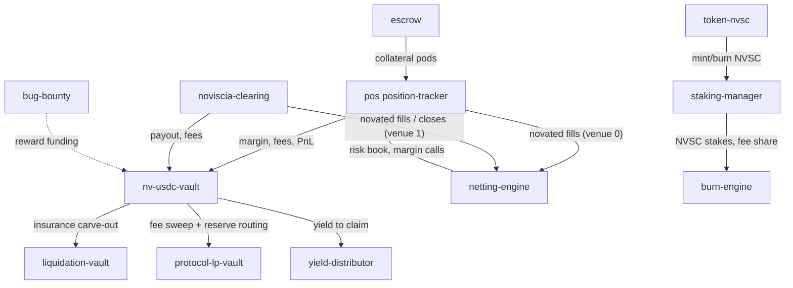

# Noviscia — As It Is Today (devnet, 2026-08-24)

**Status snapshot:** all 16 programs rebuilt from current `main` source, upgraded
in place on devnet (slots 483247186–483249477; netting-engine deploys at
483273207), IDLs synced to
`app/web/app/idl/` and live on-chain.

**Update (2026-08-15):** Ran `scripts/deploy/sync-idls.sh` to copy freshly built
IDLs into `app/web/app/idl/`. Uploaded (on-chain) IDLs for `position-tracker`
and `nv-usdc-vault` to Devnet via `anchor idl upgrade` (IDL accounts updated:
`position-tracker` → `BLBgAY2evLxvE6PsttDBLrs3mGEfK8jkuf5pdTbQ3L7Z`,
`nv-usdc-vault` → `9fJ76mtJg4PQPNFMsFvHzvWtf4rymHUCVvDrLxRfcHVc`).

---

## 1. The One-Line Picture

Noviscia is a **central counterparty (CCP)** on Solana: it interposes on both
sides of every trade (novation), nets offsetting risk, runs all margin as a
single yield-bearing omni-pool, and absorbs default losses through a funded
5-layer waterfall before LPs are ever touched.

```
                        TENANTS / USERS
   ┌────────┬──────────┬──────────┬──────────┬────────────┐
   │ Perps  │ Event    │ DEX/RWA  │ GameFi   │ LP / Stake │   ← frontends
   │ (UI)   │ markets  │ (plug-in)│ (plug-in)│ / Vault    │
   └───┬────┴────┬─────┴────┬─────┴────┬─────┴─────┬──────┘
       │         │          │          │           │
       ▼         ▼          ▼          ▼           ▼
   ┌─────────────── THE CLEARING LAYER (novation + netting) ───────────────┐
   │ position-tracker (perps book, JIT oracle, funding, liquidation)       │
   │ noviscia-clearing (event/outcome markets — parimutuel engine)         │
   └───────────────┬──────────────────────────────────────────────────────┘
                   │  margins / fees / PnL
                   ▼
   ┌─────────────── nv-usdc-vault ── OMNI-POOL + GUARANTEE FUND ──────────┐
   │  nvscUSDC shares · NAV accrual · insurance reserve · default fund     │
   │  Loss waterfall:  trader margin → cross-margin → insurance →          │
   │                   default fund → CCP equity                           │
   └───────────────┬──────────────────────────────────────────────────────┘
                   ▼
   ┌─────────────── YIELD + TOKENOMICS LAYER ──────────────────────────────┐
   │ protocol-lp-vault  yield-distributor  staking-manager  burn-engine    │
   │ token-nvsc (NVSC)  escrow (collateral pods)                           │
   └───────────────┬──────────────────────────────────────────────────────┘
                   ▼
   ┌─────────────── SUPPORT ───────────────────────────────────────────────┐
   │ liquidation-vault (auto-deleveraging) · bug-bounty (security reports) │
   └───────────────────────────────────────────────────────────────────────┘
```

## 2. The 16 Programs On-Chain

| # | Program | Build | Anchor ID | What it does |
|---|---------|-------|-----------|--------------|
| 1 | `position-tracker` | `position_tracker` | `6uvr2JcP2iMQooG76RjpCtJLoJ4NuptGyRCiMKuDR1ws` | Perps: markets, JIT oracle price verification, funding, liquidation, cross-margin hooks |
| 2 | `noviscia-clearing` | `noviscia_clearing` | `GtTJWLa6MXjZoNucGHWVnE9LpZTw6Dsr5K1gxpM1Q4fe` | Event/outcome markets: create_market, place bet, resolve, claim via parimutuel pool |
| 3 | `nv-usdc-vault` | `nv_usdc_vault` | `CN92hAtnZxbMxPdho8tugi9GDK86UpGwmnbEvk5yzAWC` | Omni-pool: deposit/withdraw nvscUSDC shares, NAV accrue, insurance carve-out, default-fund + CCP-equity reserve routing |
| 4 | `protocol-lp-vault` | `protocol_lp_vault` | `2WUt24rRNWsdi8sE56y74b7rJGgKbxSBsu7ntDkGAJkd` | Protocol LP layer: fee accumulation, LP NAV, profit share |
| 5 | `yield-distributor` | `yield_distributor` | `CrN1o75FGwcSo6ted7eKxw2kYgkaXDVeWmUaTZCTsLtw` | Yield distribution: claim_yield, compensate_yield, earned-cap |
| 6 | `staking-manager` | `staking_manager` | `HjxcKV51A7jxE2iqMCDY7EvWFL9XsheuM43DamWGabqb` | NVSC staking: tiers, rewards, cooldown |
| 7 | `burn-engine` | `burn_engine` | `nFgJEQSrKEi7FdAKC6vz5HsQ6f9QjQLBuQcQqQy45id` | Buyback & burn: accumulates trading fees, trigger_burn, vault_fee_authority |
| 8 | `token-nvsc` | `token_nvsc` | `HSaBJHaGa4Hiv1uBYPHQC4ijmnh8237a5LzM8Lyuz1YT` | NVSC governance token program |
| 9 | `escrow` | `escrow` | `2WPb3wsyp4G6zFPx8sTYf3bTDyySxwpo1Ja8H6RCHXCZ` | Collateral pods (deposit caps, close_escrow, timelocked admin migration) |
| 10 | `liquidation-vault` | `liquidation_vault` | `Cwma3FfMKhoLkgfrGYgErVPoFWEtHpx7DNc4wArpRHBz` | Auto-deleveraging, withdraw requests, insurance funding |
| 11 | `bug-bounty` | `bug_bounty` | `A8Uk9WuHumfiuuZAHt4y3t3sXmT3cpXVXaFMhpDinjSK` | On-chain security-report ledger: submit/triage/reward reports |
| 12 | `netting-engine` | `netting_engine` | `68s4vuWUXAaEFF1EM1RUQpw7SFdYZSV3opvtDqoBCs56` | Multilateral Netting & Novation ledger: venue registration, novated-fill reporting, correlation-matrix cross-margin, house book (default-fund sizing) |
| 13 | `yield-router` | `yield_router` | `FKaAPPid8B6hUme4w8bFCDzmvE6DpekXpeiR1sgyLwB4` | Yield deployment & atomic recall for margin calls |
| 14 | `cross-border` | `cross_border` | `C3uoiE3GZ47nuGwUckQPsZF8JBqgMk54nmfJYKqAEMbv` | Cross-border stablecoin settlement (research-phase) |
| 15 | `clearing-registry` | `clearing_registry` | `Hg5QvSsnb22gHexUTnvvfff3EJZxWnsFKRM8bZ8n7Jmo` | Multi-tenant clearing registry |
| 16 | `spot-dex` | `spot_dex` | `8C4try8mEHukT4Z99Dpi3x1rNaBYhXms81uoU47JwLiN` | Constant-product AMM DEX |

All upgrade authority: `pm2tUw22SDofzdfmyJv3jRDhLagwiqYRmCG2BWN23NA`
(`~/.config/solana/new-id.json`).

## 3. The Loss Waterfall (enforced on-chain)

```
 1  Trader initial margin (locked nvscUSDC shares)
 2  Trader cross-margin (other product collateral)
 3  Per-market insurance fund      (10% of liquidation penalties)
 4  Global default fund            (15% of fees → 2.5% of OI target)
 5  CCP equity                     (15% of default fund — skin in the game)
    ─ LP yield / stakers touched only if every prior layer is exhausted ─
```

## 4. Use Cases — Live Right Now

1. **Perps trading** (`/trade/perps`) — up to 50× leverage, fully on-chain
   matching, JIT oracle price verification, funding, TP/SL, permissionless
   liquidation. Margin = nvscUSDC shares that keep yielding while locked.
2. **Event / prediction markets** (`/trade/prediction`) — stubbed; parimutuel
   clearing engine compiled but not yet wired to frontend.
3. **Omni-pool vault** (`/earn/vault`) — deposit any asset, mint yield-bearing
   nvscUSDC, earn fee + strategy yield, atomic recall for margin calls.
4. **Staking** (`/earn/stake`) — stake NVSC, earn ~15% of protocol fees,
   tiered discounts, vote on parameters.
5. **LPs** (`/earn/lp`) — protocol LP vault share of fee revenue.
6. **Loans / insurance / rewards** (`/earn/loans`, `/earn/insurance`,
   `/earn/rewards`) — collateralized lending surfaces, insurance fund, reward
   claims.
7. **Collateral management** (`/trade/collateral`, `/manage/*`) — deposit,
   withdraw, portfolio, positions, orders, triggers, liquidations.
8. **Token** (`/token`) — NVSC supply, governance, burn status.
9. **Bug bounty** — on-chain security-report ledger (submit/triage/reward).
10. **Tenant settlement web** — DEX/GameFi/RWA frontends route settlement into
    the CCP (vision; contract surface ready, tenants to plug in).

## 5. Program → Interaction Graph



## 6. State Audit Trail

- Rebuilt + upgraded on 2026-08-12 against `main` (HEAD `180b95a4`).
- IDLs regenerated, synced to `app/web/app/idl/`, uploaded to devnet for all 16.
- Deployment scripts: `scripts/deploy/upgrade-*-devnet.sh` (one per program).
- Proof: `solana program show <id>` slots 483247186–483249477, all fresh.

## 7. Gaps (documented, not yet built)

- Claim expiry + residual-sweep waterfall in `noviscia-clearing` (Phase 2 edits).
- Cross-margin correlation matrix (netting engine). **Deployed 2026-08-12** — `netting-engine` live at `68s4vuWUXAaEFF1EM1RUQpw7SFdYZSV3opvtDqoBCs56`, config + house book initialized, venue #0 = perps (position-tracker), venue #1 = event (noviscia-clearing) registered. **Venue reporting deployed 2026-08-14** — `noviscia-clearing` upgraded at `GtTJWLa6MXjZoNucGHWVnE9LpZTw6Dsr5K1gxpM1Q4fe` to the netting-CPI build (fill/close → `report_fill` / `report_position_close` via the `clr-config` PDA; slot 483898757, code verified byte-identical, IDL `2YBsh87nPFPDCat4EovxfuGYrfGXeVjW2QEvArGCLQr8`). The earlier `ClaimUserFunds` 4104B stack-frame overflow was resolved in commit `df87e113` and the program builds clean. Cross-tenant CCP book now consolidates fills/closes into the engine.
- Third-party tenant onboarding flows (contract hooks exist, no tenant live).
- Mainnet deploy (devnet only; `[programs.mainnet]` still placeholders).

## 8. CCP Topology Gap Closure (2026-08-14)

The four topology gaps are now closed in code (compiling, unit-tested, and deployed to devnet):

### Gap 4 — Atomic Recall on margin trigger (ON-CHAIN, DEPLOYED)
- New program `programs/yield-router` (ID `FKaAPPid8B6hUme4w8bFCDzmvE6DpekXpeiR1sgyLwB4` — matches the ID hardcoded as `YIELD_ROUTER_PROGRAM_ID` in `nv-usdc-vault`). Keypair `.keys/yield-router-devnet.json` already derives to this address. Instructions: `initialize`, `set_admin`, `allocate_idle` (permissionless), `recall_for_margin` (callable by `pt-config` PDA, `clr-config` PDA, or router admin). Vault gate: `yr-config` PDA is the sole `allocate_to_yield`/`recall_from_yield` authority the omni-pool accepts.
- `position-tracker` now composes the recall **in the same transaction** as liquidation: `helpers::AtomicRecallAccounts` + `parse_recall_accounts` (offset 5, after the 5 netting accounts) + `recall_margin_if_short` are wired into both `liquidate` and `liquidate_dutch_auction`, *before* the protocol-shares redemption. Recall is best-effort/backward compatible: it only runs when the 7 accounts are present, the venue pot exists, and on-hand LP-owned USDC (`vault_usdc.amount − non_lp_reserves`) is short of the redemption amount. Shortfall = `needed − lp_on_hand`, capped at `outstanding_yield_receivable`.
- Verified: `cargo check -p position-tracker -p yield-router` (warnings only), `cargo test -p yield-router` 3/3 pass, full `cargo check --workspace` clean.
- **Deployed 2026-08-14:**
  - `yield_router` live at `FKaAPPid8B6hUme4w8bFCDzmvE6DpekXpeiR1sgyLwB4` (sig `sLrYjXEFNHvNhkih1Lf3jHq9gkHL6AFwzPo4uBbHrypLE9nRnw5ejVXCeJ1Zor2k75nqHDWGdhsNQ1CcYdCQYtN`); `yr-config` initialized at `36NVE7fjNFD1SnVZMDJenLBZV7A653enNc9dj85UtCrE`, venue USDC ATA `GmJ6CFBoMu24T8JRsK2JK5Szq93gSStUjLxZtpucgaGP`; IDL uploaded (account `9d3vYZ22mPNRJzx2LLF94nos8JAPBYwjyhv5qf8A78kQ`).
  - `position-tracker` upgraded to the atomic-recall build at `3zGRWKZq4V3npHbH9Lati46BwgmstTjynWZFFMxarQgY` (new ProgramData, slot 483894136, data 2,534,480 B); new IDL uploaded (account `BLBgAY2evLxvE6PsttDBLrs3mGEfK8jkuf5pdTbQ3L7Z`).
- Deploy: `scripts/deploy/upgrade-yield-router-devnet.sh`; init: `scripts/init/init-yield-router-devnet.ts` (creates `yr-config` + venue USDC ATA). Added to `Anchor.toml` `[programs.devnet]` + `[programs.localnet]`.
- E2E liquidation scripts (`e2e-liquidate-devnet.ts`, `e2e-liquidation-devnet.ts`, `e2e-liquidation-eth-devnet.ts`, `e2e-liquidation-bonk-devnet.ts`) now pass `[...nettingRemainingAccounts, ...recallRemainingAccounts]` on every `liquidate` (typecheck clean).

### Gap 3 — Off-chain liquidation keeper (SERVICE, DONE)
- New `services/liquidation-keeper` — polls every open position (raw 174-byte decode), batch-fetches JIT Pyth prices from Hermes in one call, executes TP/SL, liquidations, and funding settlement. Every liquidation passes the 5 netting-engine accounts **and** the 7 yield-router accounts (atomic recall). It is also the first *producer* for the websocket `POST /internal/broadcast` alert ingest (`alerts:global` + `alerts:{wallet}`). Dockerized + registered in `docker-compose.yml`. Smoke-tested against live devnet (boots, scans cleanly, atomic-recall + funding enabled). `docker-compose.yml` devnet RPC switched to Helius (`SOLANA_RPC_DEVNET`, overridable) — ankr's devnet endpoint now requires an API key, and Alchemy's Free tier blocks `getProgramAccounts`.

### Gap 2 — VaR / Expected-Shortfall analytics (SERVICE, DONE)
- New `services/risk-engine` — reads the netting ledger (`NettingConfig`/`Venue[]`/`HouseBook`/`NettingSet[]` via the IDL coder) + open perps (symbol exposure, trader concentration), maintains a rolling log-return series per feed (warm start from Hermes history), and computes **VaR₉₅/VaR₉₉ + Expected Shortfall** two ways: historical simulation and parametric (full covariance). Reports `default-fund utilization = VaR₉₉ / HouseBook.default_fund_target_usdc` with `ok/elevated/critical` status and pushes breach alerts to the websocket. `GET /risk`, `GET /health`. Dockerized + registered in `docker-compose.yml`.

### Gap 1 — Universal Developer SDK (PACKAGE, DONE)
- New top-level `sdk/` (`@noviscia/sdk`, framework-agnostic, runs in Node + browser):
  - `ids.ts` — every program id + mint, env-overridable.
  - `addresses.ts` — PDA derivation for position-tracker, netting-engine, yield-router, nv-usdc-vault, burn/staking fee routing.
  - `client.ts` — `NovisciaClient` wrapping all six anchor programs (IDLs from `target/idl`).
  - `collateral.ts` — **Unified Collateral Gateway**: `deposit` / `withdraw` (omni-pool), `openPosition`, `liquidate` (netting + atomic-recall composed), `recallForMargin` (yield-router).
  - `payloads.ts` — payload translators: execution, clearing, netting-report, liquidation, recall + content digest.
  - `sandbox.ts` — simulate-first: `simulate` (dry-run versioned tx), `assertAccountsExist` (state-isolation pre-check), `fetchJitPrice` (Hermes).
  - `npm run build` emits `dist/` with type declarations.

### Not yet deployed / remaining
- E2E atomic-recall liquidation proof (open underwater position → liquidate with netting+recall accounts → assert `outstanding_yield_receivable` dropped) to be exercised when a healthy devnet market exists.