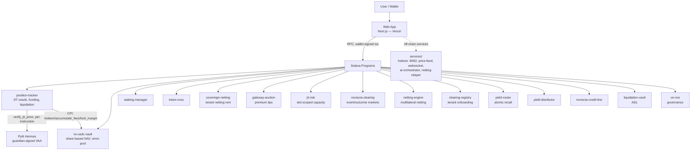
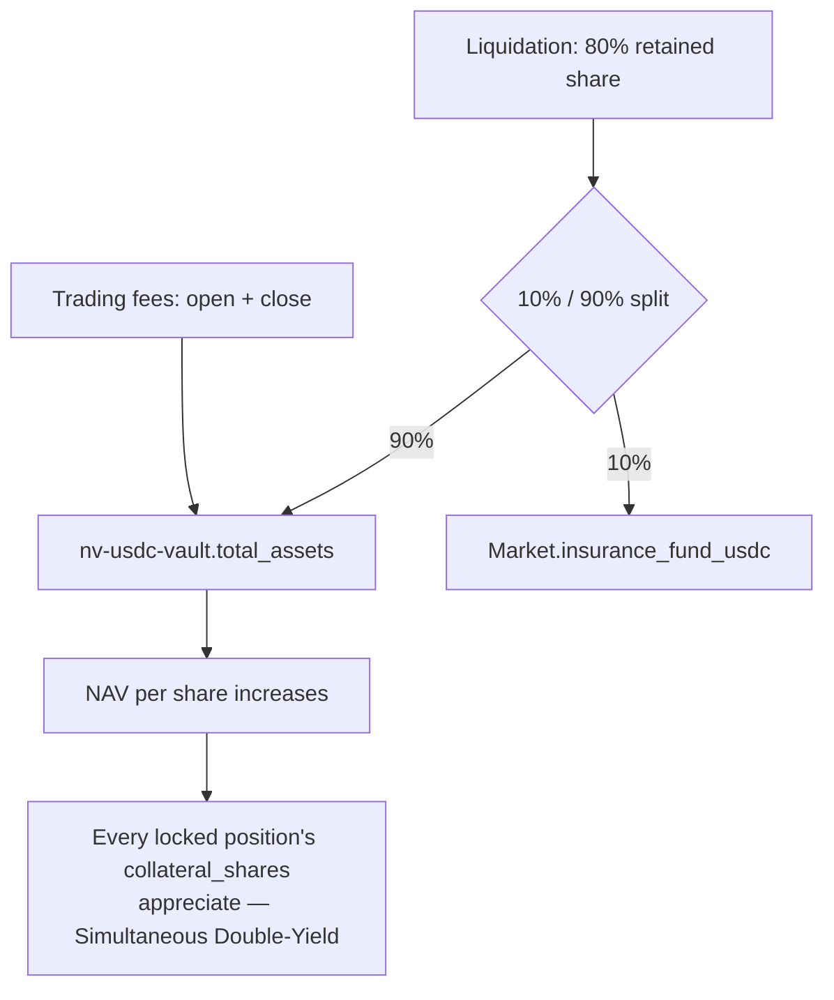
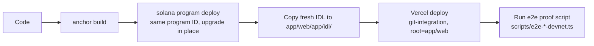
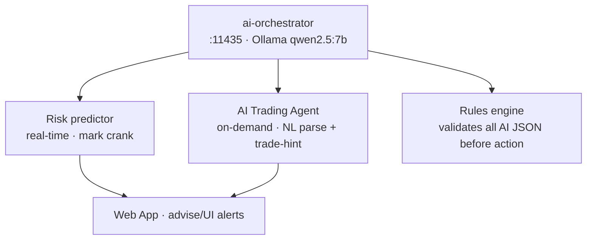
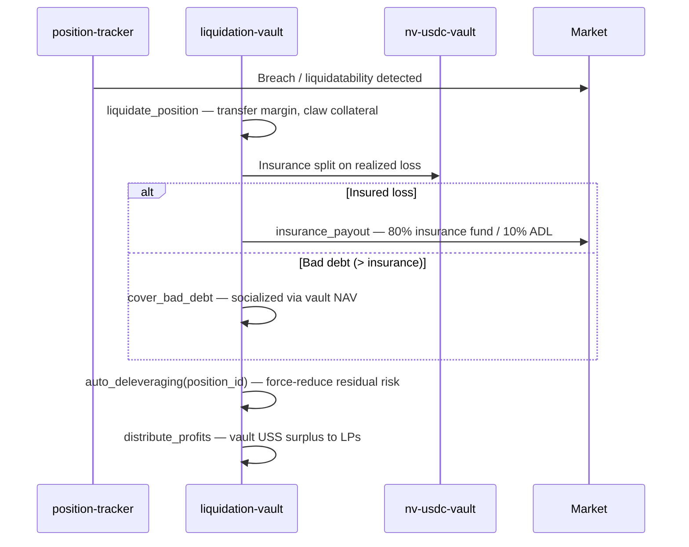
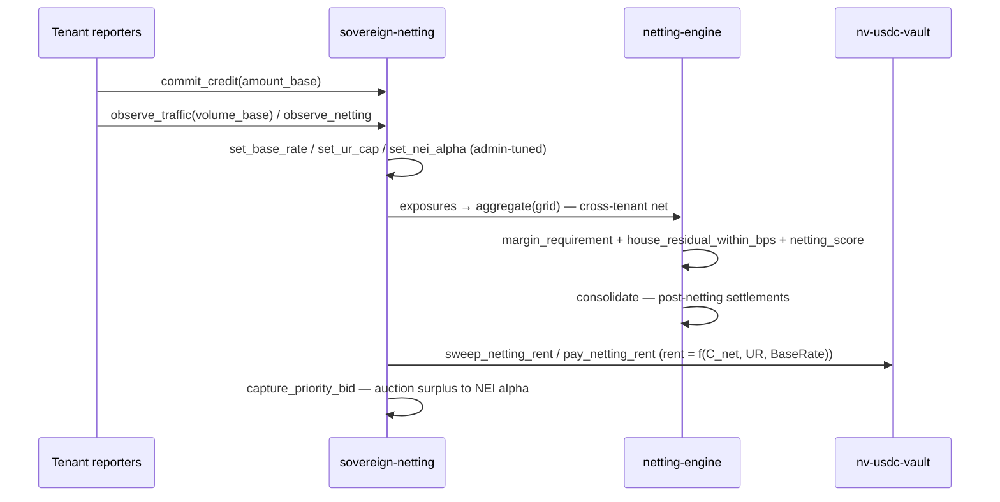
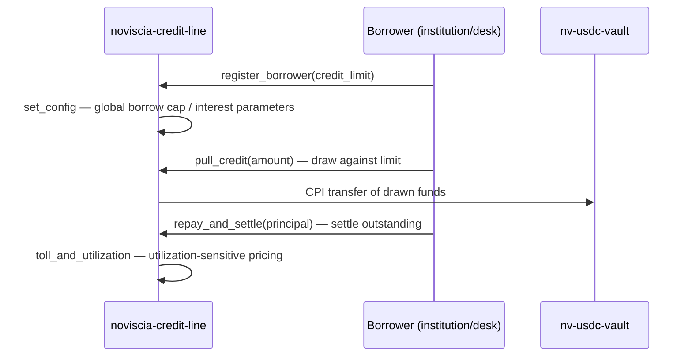
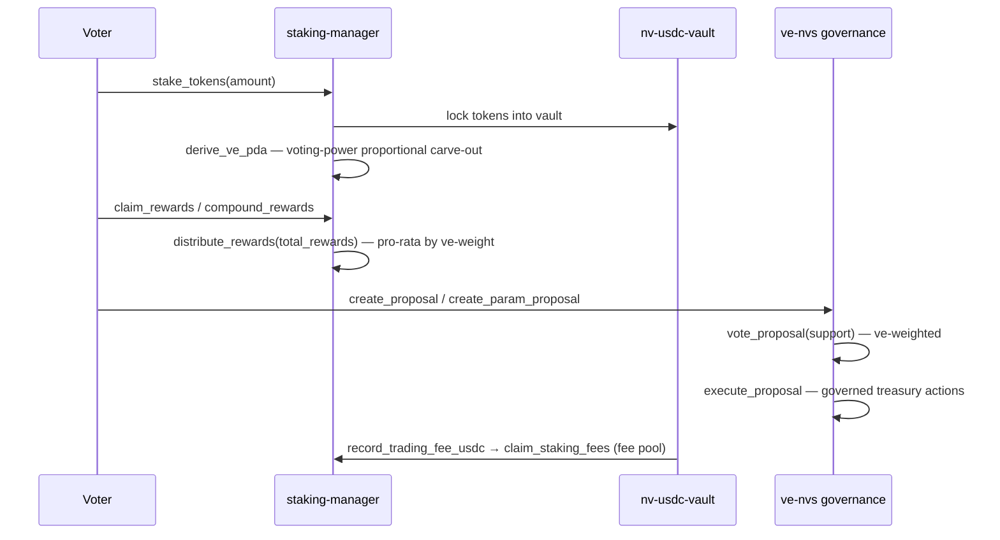
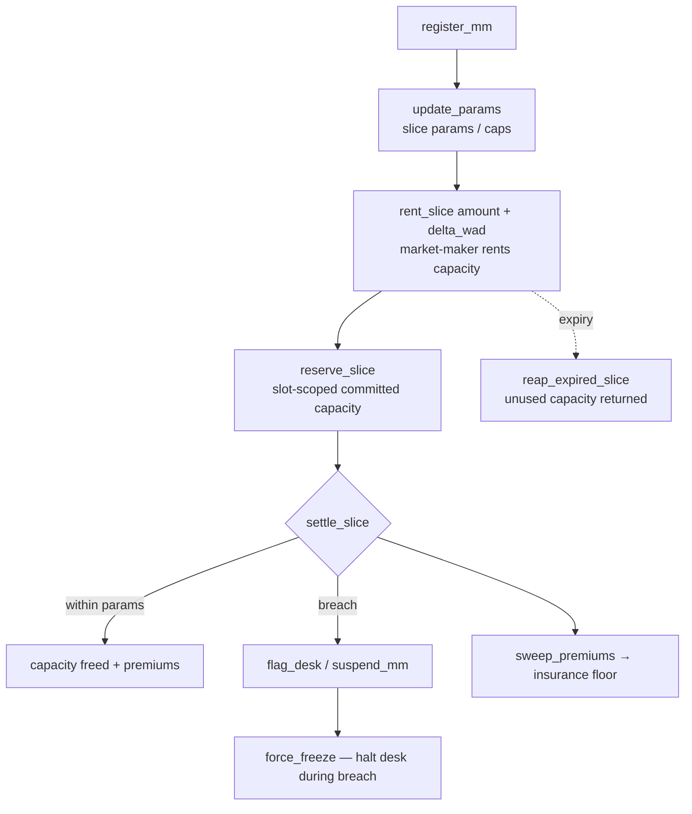

# Noviscia System Diagram

**Last updated:** September 5, 2026 — diagrams reflect live devnet architecture (19 active programs, 7 services).

## 1) System Structure

## 2) Trade Flow (open_position_jit)

A retry (fresh VAA + new signature) happens automatically if the 30-second freshness window races network latency — this is expected, not an error.

## 3) Yield Flow (perps)

No external lending venue sits in this path — those integrations were fully retired from `nv-usdc-vault`.

## 4) Deployment Flow

## Target shape (current)

- **Frontend:** wallet-connected trading UI, deployed to Vercel — no separate API server for core trading
- **Programs:** own all custody, margin, oracle verification, funding, liquidation, staking, netting, gateway auction, and JIT risk logic (19 active programs)
- **Services:** indexer (:8092), price-feed, websocket, ai-orchestrator, netting-relayer — each dockerized, off the critical trading path
- **No database:** on-chain accounts are the only persistence layer for perps state

## 5) AI Orchestration Layer

| Agent | Cadence | Endpoint |
|-------|---------|----------|
| Risk predictor | Real-time (mark crank) | `POST /decide` (orchestrator) |
| Trading agent (NL parse) | On-demand | `POST /api/ai/parse-trade`, `/decide` |
| Trading agent (trade hint) | On-demand | `POST /api/ai/trade-hint`, `/decide` |

Live status: `GET /api/ai/health` · `GET /api/ai/orchestration` (web) · `GET /health` (orchestrator).

The `ai-orchestrator` service is a local (Ollama + `qwen2.5:7b`) LLM proxy — no cloud
APIs. Every AI response is validated by the rules engine before any action is taken.

## 6) Liquidation Flow (liquidation-vault ADL)

Institution/trade positions that breach the desk's margin are force-closed here; the 80/10 split follows the Yield Flow (§3) convention on retained vs insurance-fund share.

## 7) Netting Flow (sovereign-netting → netting-engine)

Netting rent is charged on observed cross-tenant volumes; the engine applies venue haircuts and correlation-based cross-margining before `consolidate` lands settlements.

## 8) Credit-Line Flow (noviscia-credit-line)

Draws are capped at the registered `credit_limit`; utilization shapes the marginal toll. The aggregate institutional credit line in the asset-engine mirrors this flow with the three-tier committee signer (see `ACCOUNT_MAP.md`).

## 9) Staking Flow (staking-manager)

Discount rates (`get_discount_rate` / `get_liquid_discount_rate`) tier fee/borrow pricing by staked depth; `ve-nvs` ties governance influence to locked stake.

## 10) TVV Slice Lifecycle (jit-risk)

## Notes

- Keep the **web app** as the only user-facing entry point.
- Keep **Solana programs** as the source of truth for funds.
- Keep **off-chain services** stateless where possible.
- Broadcast live updates through **WebSocket**, not polling.
- Architecture-flow and roadmap-timeline diagrams: source `.mmd` files are in `docs/assets/`. Regenerate SVGs from them (`mmdc -i *.mmd -o *.svg`). Do not hand-edit SVGs.
