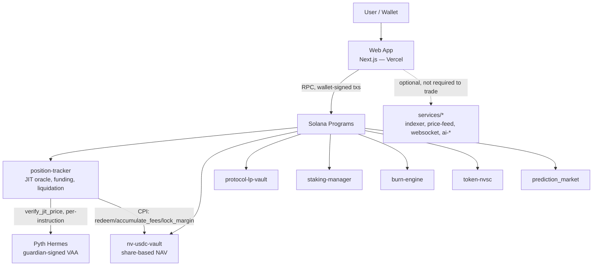
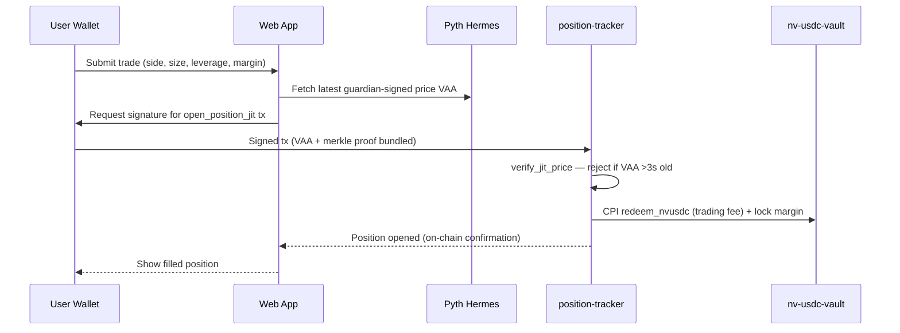
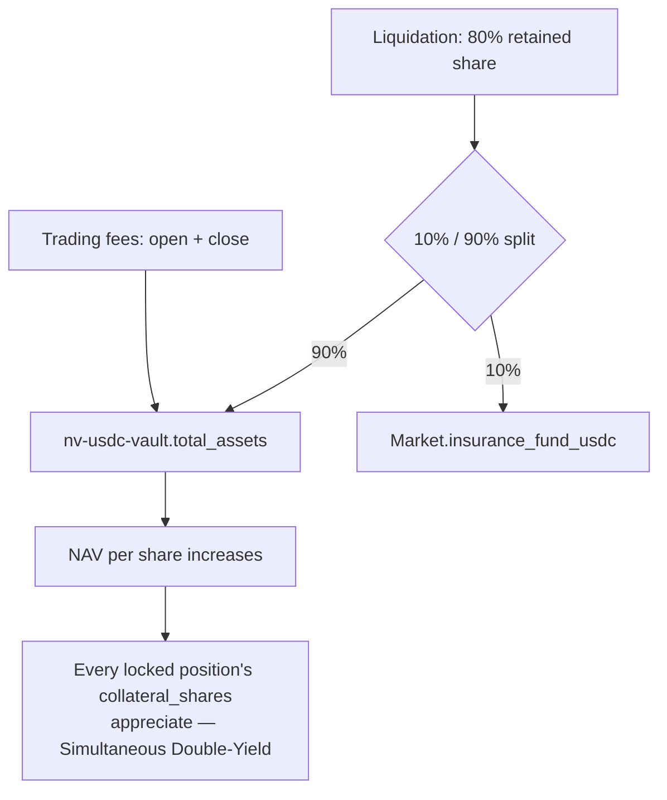
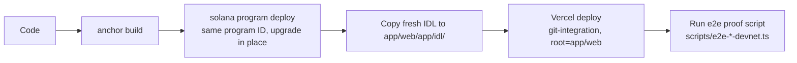

# Noviscia System Diagram

**Last updated:** July 7, 2026 — diagrams 1–4 rewritten to match the current JIT-oracle architecture (no Express/Postgres/Redis backend, no external lending venues, no Switchboard). Diagram 5 (AI layer) is unchanged/unverified this cycle.

## 1) System Structure



## 2) Trade Flow (open_position_jit)



A retry (fresh VAA + new signature) happens automatically if the 3-second freshness window races network latency — this is expected, not an error.

## 3) Yield Flow (perps)



No external lending venue sits in this path — those integrations were fully retired from `nv-usdc-vault`.

## 4) Deployment Flow



## Target shape (current)

- **Frontend:** wallet-connected trading UI, deployed to Vercel — no separate API server for core trading
- **Programs:** own all custody, margin, oracle verification, funding, liquidation, staking, and burn logic
- **Optional services:** indexer/price-feed/websocket/AI layer, each dockerized separately, not on the critical trading path
- **No database:** on-chain accounts are the only persistence layer for perps state

## 5) AI Orchestration Layer (devnet — local Ollama)

```
┌─────────────────────────────────────────────────────────────────────────────────────┐
│                         AI ORCHESTRATION LAYER                                      │
│  ┌─────────────────┐  ┌─────────────────┐  ┌─────────────────┐  ┌───────────────┐ │
│  │  AI Yield       │  │  AI Risk        │  │  AI Rebalancer  │  │  AI Trading   │ │
│  │  Router         │  │  Predictor      │  │                 │  │  Agent API    │ │
│  │  (30-min)       │  │  (Real-time)    │  │  (Hourly)       │  │  (NL / hint)  │ │
│  └────────┬────────┘  └────────┬────────┘  └────────┬────────┘  └───────┬───────┘ │
│           └────────────────────┴────────────────────┴──────────────────┘         │
│                                      │                                              │
│                              ┌───────┴───────┐                                      │
│                              │  Orchestrator │  :11435                              │
│                              │  + Ollama     │  qwen2.5:7b                          │
│                              └───────┬───────┘                                      │
└──────────────────────────────────────┼──────────────────────────────────────────────┘
                                       │
                    ┌──────────────────┴──────────────────┐
                    │ ai-rebalancer (execute) · Web (advise/UI) │
                    └─────────────────────────────────────┘
```

| Agent | Cadence | Service | Orchestrator path |
|-------|---------|---------|-------------------|
| Yield Router | 30 min | `services/ai-rebalancer` | `POST /agents/yield` |
| Rebalancer | Hourly | `services/ai-rebalancer` | `POST /agents/rebalance` |
| Trading Agent | On-demand | `app/web` perps UI | `POST /agents/parse-trade`, `/agents/trade-hint` |

(Risk Predictor was removed along with the keeper service and has no replacement.)

Live status: `GET /api/ai/orchestration` (web) · `GET /orchestration/status` (orchestrator).

Rules engine validates all AI JSON before it acts. See `docs/AI_INTEGRATION.md`.

## Notes

- Keep the **web app** as the only user-facing entry point.
- Keep **Solana programs** as the source of truth for funds.
- Keep **off-chain services** stateless where possible.
- Broadcast live updates through **WebSocket**, not polling.
