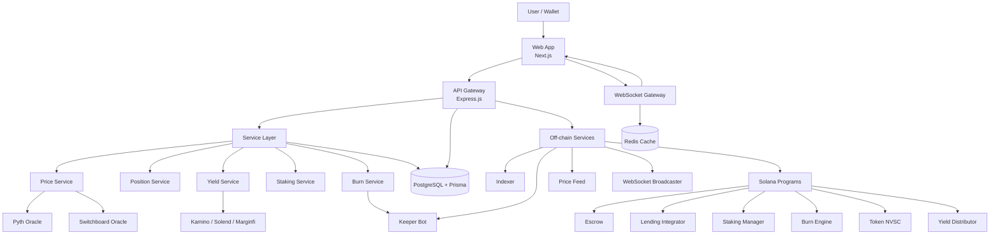
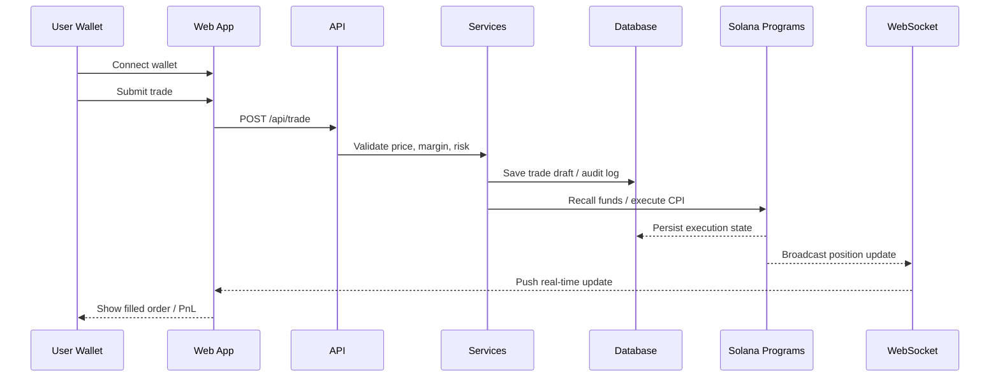
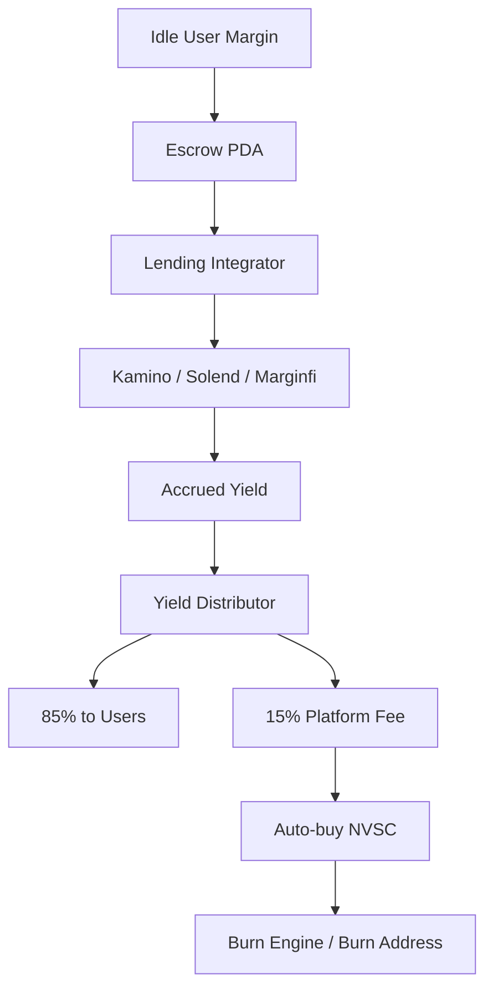
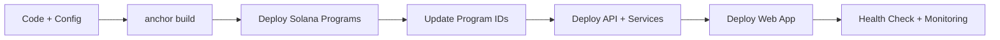

# Noviscia System Diagram

## 1) System Structure

## 2) Trade Flow

## 3) Yield Flow

## 4) Deployment Flow

## Target Shape

- **Frontend:** wallet-connected trading UI
- **API:** validates requests and exposes market/user endpoints
- **Services:** keep prices, logs, and automation live
- **Programs:** own custody, staking, yield, and burn logic
- **Data:** PostgreSQL for persistence, Redis for fast live state

## Notes

- Keep the **web app** as the only user-facing entry point.
- Keep **Solana programs** as the source of truth for funds.
- Keep **off-chain services** stateless where possible.
- Broadcast live updates through **WebSocket**, not polling.
